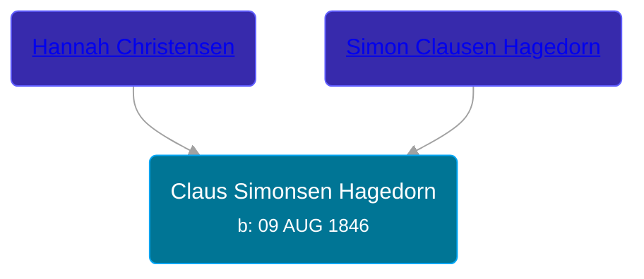

## 🔵 Claus Simonsen Hagedorn
<small>Age: 90y, 4m, 8d</small>

Son of [Simon Clausen Hagedorn](/people/5/50450582) and [Hannah Christensen](/people/1/1113854)





### 📆 Events


Type | Date | Age at Event | Place
------ | ------ | ------ | ------
[Birth](#event-event-0) | 09 AUG 1846 |  | Denmark
[Emigration](#event-event-1) | 15 APR 1867 | 20y, 8m, 6d | Hamburg, Germany
[Immigration](#event-event-2) | 23 MAY 1867 | 20y, 9m, 14d | New York, New York, United States
[Residence](#event-event-3) | 12 JUN 1900 | 53y, 10m, 3d | Peterson Township, Clay, Iowa, USA
[Residence](#event-event-4) | 15 APR 1910 | 63y, 8m, 6d | Douglas, Clay, Iowa, USA
[Residence](#event-event-5) | 1915 | 68y, 3m, 21d | Royal Town, Clay, Iowa, USA
[Death](#event-event-6) | 17 DEC 1936 | 90y, 4m, 8d | Royal, Clay, Iowa, USA
[Burial](#event-event-7) |  |  | Willow Creek Cemetery, Clay, Iowa, USA



- **[Birth](#event-event-0)**
**Date**: 09 AUG 1846, Age:
**Place**: Denmark
- **[Emigration](#event-event-1)**
**Date**: 15 APR 1867, Age: 20y, 8m, 6d
**Place**: Hamburg, Germany
- **[Immigration](#event-event-2)**
**Date**: 23 MAY 1867, Age: 20y, 9m, 14d
**Place**: New York, New York, United States
- **[Residence](#event-event-3)**
**Date**: 12 JUN 1900, Age: 53y, 10m, 3d
**Place**: Peterson Township, Clay, Iowa, USA
- **[Residence](#event-event-4)**
**Date**: 15 APR 1910, Age: 63y, 8m, 6d
**Place**: Douglas, Clay, Iowa, USA
- **[Residence](#event-event-5)**
**Date**: 1915, Age: 68y, 3m, 21d
**Place**: Royal Town, Clay, Iowa, USA
- **[Death](#event-event-6)**
**Date**: 17 DEC 1936, Age: 90y, 4m, 8d
**Place**: Royal, Clay, Iowa, USA
- **[Burial](#event-event-7)**
**Date**:
**Place**: Willow Creek Cemetery, Clay, Iowa, USA


## 👩‍❤️‍👨 Relationships

### 🟣 [Inger Marie Svensdatter](/people/4/41786466), b. 30 MAR 1848

#### Events


Type | Date | Age at Event | Place
------ | ------ | ------ | ------
[Marriage](#event-family-0-event-0) | 18 NOV 1871 | 25y, 3m, 9d | Fjelstrup Sogn, Haderslev Amt, Denmark



- **[Marriage](#event-family-0-event-0)**
**Date**: 18 NOV 1871, Age: 25y, 3m, 9d
**Place**: Fjelstrup Sogn, Haderslev Amt, Denmark


#### Children With Inger Marie Svensdatter
* 🔵 [James S. Hagedorn](/people/7/70562989), b. Oct 1886
* 🟣 [Igna Marie Hagedorn](/people/2/26272663), b. Dec 1887
* 🟣 [Claudine Dusina Hagedorn](/people/2/21896640), b. 27 JUN 1888
* 🔵 [Christian Simon Hagedorn](/people/9/92811722), b. 17 MAR 1891
### 📰 Event Sources

####  Birth, 09 AUG 1846
* Denmark, Church Records, 1812-1924

####  Emigration, 15 APR 1867
* Hamburg Passenger Lists, 1850-1934
>
  > Name:Claus Hagedorn
  > Departure Date:15 Apr 1867
  > Birth Date:abt 1844
  > Age:23
  > Gender:männlich (Male)
  > Relationship:Sohn (Son)
  > Residence:Sipsdorf, Holstein (Schleswig-Holstein)
  >
  > Ship Name:Eugenie
  > Captain:Cahnbley
  > Shipping Clerk:Donati & Co.
  > Shipping line:Rob. M. Sloman
  > Ship Type:Segelschiff
  > Accommodation:Zwischendeck
  > Ship Flag:Deutschland
  > Port of Departure:Hamburg
  > Port of Arrival:New York
  >
  > Volume:373-7 I, VIII A 1 Band 021 A

####  Immigration, 23 MAY 1867
* New York, Passenger Lists, 1820-1957

####  Residence, 12 JUN 1900
* 1900 US Census

####  Residence, 15 APR 1910
* 1910 US Census

####  Residence, 1915
* 1915 Iowa State Census

####  Death, 17 DEC 1936
* U.S., Evangelical Lutheran Church of America, Records, 1875-1940
* Iowa, U.S., Death Records, 1880-1968
>
  > Name: Claus Simonsen Hagedorn
  > Gender: Male
  > Age: 90
  > Birth Date: abt 1846
  > Death Date: 17 Dec 1936
  > Death Place: Royal, Clay, Iowa, USA
  > Father: Simon Clausen Hagedorn
  > Mother: Hannah Christensen
  > Spouse: Inger Marie Hagedorn
  > Certificate Number: 21132
  >

####  Burial
* findagrave.com
>
  > Claus S. Hagadorn
  > Birth Date:1846
  > Death Date:1936
  > Cemetery:Willow Creek Cemetery
  > Burial or Cremation Place:Royal, Clay County, Iowa, USA
* Iowa, Cemetery Records, 1662-1999
>
  > Name:Claus S Hagadorn
  > Birth Date:1846
  > Death Date:1936
  > Age:90
  > Burial Location:Royal, Clay
  > Cemetery:Willow Creek
  > Source:Clay County, Iowa Grave Records
  > Page Number:30
####  Marriage, 18 NOV 1871
* Denmark, Church Records, 1812-1924
>
  > Name: Claus Simonsen Hagedorn
  > Gender: Male
  > Marriage Age: 25
  > Event Type: Marriage
  > Birth Date: 9 Aug 1846
  > Marriage Date: 18 Nov 1871
  > Marriage Place: Fjelstrup Sogn, Haderslev Amt, Danmark (Denmark)
  > Father: Simon Clausen Hagedorn
  > Mother: Anne Johanne Christensdatter
  > Spouse: Ingrid Marie Svensdatter
  > Spouse Gender: Female
  > Spouse Marriage Age: 23
  > Spouse Birth Date: 30 Mar 1848
  > Spouse Father: Sven Jønsson
  > Spouse Mother: Brita Cathrine Andersdatter
  >

