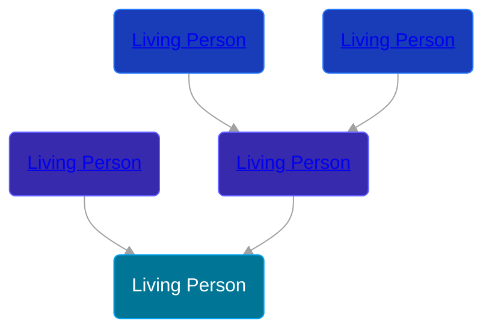

## 🟣 Living Person

Daughter of [Living Person](/people/2/23724860) and [Living Person](/people/8/8527359)



```mermaid
graph
classDef grands fill:#193cb8,stroke:#2b7fff,stroke-width:1px,color:#fff;
classDef parents fill:#372aac,stroke:#615fff,stroke-width:1px,color:#fff;
classDef primary fill:#007595,stroke:#00a6f4,stroke-width:1px,color:#fff;
89706899(Living Person):::primary
8527359(<a class="text-white" href="/people/8/8527359">Living Person</a>):::parents-->89706899
23724860(<a class="text-white" href="/people/2/23724860">Living Person</a>):::parents-->89706899
44129601(<a class="text-white" href="/people/4/44129601">Living Person</a>):::grands-->23724860
11913320(<a class="text-white" href="/people/1/11913320">Living Person</a>):::grands-->23724860
linkStyle default stroke:#a1a1a1
```

