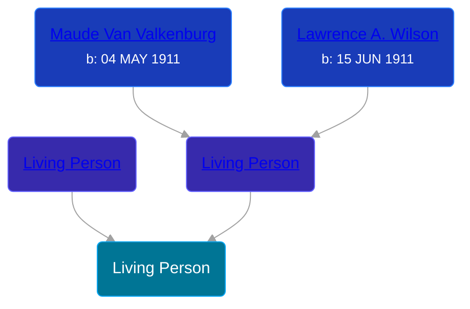

## 🔵 Living Person

Son of [Living Person](/people/4/44847084) and [Living Person](/people/8/82611736)



```mermaid
graph
classDef grands fill:#193cb8,stroke:#2b7fff,stroke-width:1px,color:#fff;
classDef parents fill:#372aac,stroke:#615fff,stroke-width:1px,color:#fff;
classDef primary fill:#007595,stroke:#00a6f4,stroke-width:1px,color:#fff;
89830286(Living Person):::primary
82611736(<a class="text-white" href="/people/8/82611736">Living Person</a>):::parents-->89830286
44847084(<a class="text-white" href="/people/4/44847084">Living Person</a>):::parents-->89830286
43859609(<a class="text-white" href="/people/4/43859609">Maude Van Valkenburg</a><br /><small>b: 04 MAY 1911</small>):::grands-->44847084
86477632(<a class="text-white" href="/people/8/86477632">Lawrence A. Wilson</a><br /><small>b: 15 JUN 1911</small>):::grands-->44847084
linkStyle default stroke:#a1a1a1
```

