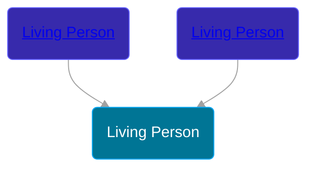

## 🟣 Living Person

Daughter of [Living Person](/people/6/62526472) and [Living Person](/people/4/49057172)



```mermaid
graph
classDef grands fill:#193cb8,stroke:#2b7fff,stroke-width:1px,color:#fff;
classDef parents fill:#372aac,stroke:#615fff,stroke-width:1px,color:#fff;
classDef primary fill:#007595,stroke:#00a6f4,stroke-width:1px,color:#fff;
89857212(Living Person):::primary
49057172(<a class="text-white" href="/people/4/49057172">Living Person</a>):::parents-->89857212
62526472(<a class="text-white" href="/people/6/62526472">Living Person</a>):::parents-->89857212
linkStyle default stroke:#a1a1a1
```

