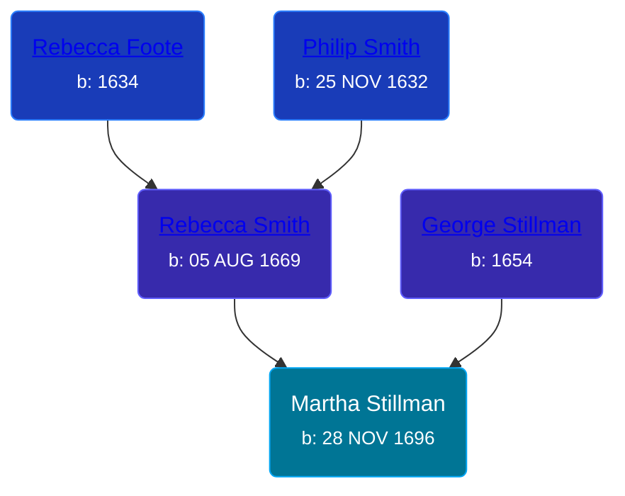

## 🟣 Martha Stillman
<small>Age: 15y, 10m, 4d</small>

Daughter of [George Stillman](/people/6/67040632) and [Rebecca Smith](/people/7/76162584)





### 📆 Events


Type | Date | Age at Event | Place
------ | ------ | ------ | ------
[Birth](#event-event-2) | 28 NOV 1696 |  | Hadley, Massachusetts, USA
[Death](#event-event-3) | 02 OCT 1712 | 15y, 10m, 4d |



- **[Birth](#event-event-2)**
**Date**: 28 NOV 1696, Age:
**Place**: Hadley, Massachusetts, USA
- **[Death](#event-event-3)**
**Date**: 02 OCT 1712, Age: 15y, 10m, 4d
**Place**:


### 📰 Event Sources

####  Birth, 28 NOV 1696
* The Foote Family: or the Descendants of Nathaniel Foote  - 279

####  Death, 02 OCT 1712
* The Foote Family: or the Descendants of Nathaniel Foote  - 279