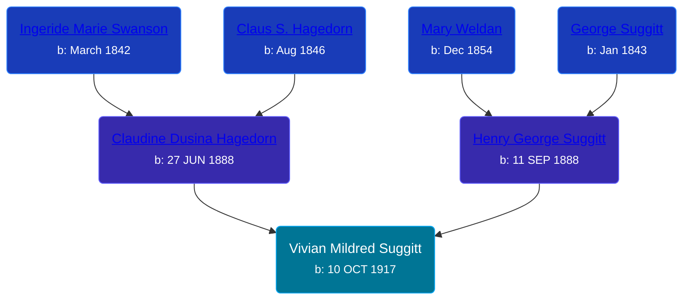

## 🟣 Vivian Mildred Suggitt
<small>Age: 75y, 1m, 20d</small>

Daughter of [Henry George Suggitt](/people/7/7271894) and [Claudine Dusina Hagedorn](/people/2/21896640)





### 📆 Events


Type | Date | Age at Event | Place
------ | ------ | ------ | ------
[Birth](#event-event-2) | 10 OCT 1917 |  | Clay Township, Clay, Iowa, USA
[Residence](#event-event-0) | 14 FEB 1920 | 2y, 4m, 4d | Riverton Township, Clay, Iowa, USA
[Residence](#event-event-1) | 01 JAN 1925 | 7y, 2m, 21d | Lincoln, Clay, Iowa, USA
[Residence](#event-event-2) | 09 APR 1930 | 12y, 5m, 29d | Royal Town, Clay, Iowa, USA
Death | 1993 | 75y, 1m, 20d | Sioux City, Woodbury, Iowa, USA



- **[Birth](#event-event-2)**
**Date**: 10 OCT 1917, Age:
**Place**: Clay Township, Clay, Iowa, USA
- **[Residence](#event-event-0)**
**Date**: 14 FEB 1920, Age: 2y, 4m, 4d
**Place**: Riverton Township, Clay, Iowa, USA
- **[Residence](#event-event-1)**
**Date**: 01 JAN 1925, Age: 7y, 2m, 21d
**Place**: Lincoln, Clay, Iowa, USA
- **[Residence](#event-event-2)**
**Date**: 09 APR 1930, Age: 12y, 5m, 29d
**Place**: Royal Town, Clay, Iowa, USA
- **Death**
**Date**: 1993, Age: 75y, 1m, 20d
**Place**: Sioux City, Woodbury, Iowa, USA


## 👩‍❤️‍👨 Relationships

### 🔵 [Raymond W. Hogan](/people/7/7348108), b. 17 JUN 1919

#### Events


Type | Date | Age at Event | Place
------ | ------ | ------ | ------
Marriage | 03 NOV 1939 | 22y, 23d | Sioux City, Woodbury, Iowa, USA



- **Marriage**
**Date**: 03 NOV 1939, Age: 22y, 23d
**Place**: Sioux City, Woodbury, Iowa, USA


#### Children With Raymond W. Hogan
* 🔵 [Living Person](/people/9/91001980)
* 🟣 [Living Person](/people/8/87259250)
* 🔵 [Living Person](/people/6/61729265)
### 📰 Event Sources

####  Birth, 10 OCT 1917
* Iowa, Births and Christenings Index, 1857-1947  - 1434999

####  Residence, 14 FEB 1920
* 1920 US Census

####  Residence, 01 JAN 1925
* 1925 Iowa State Census

####  Residence, 09 APR 1930
* 1930 US Census

####  Marriage, 03 NOV 1939