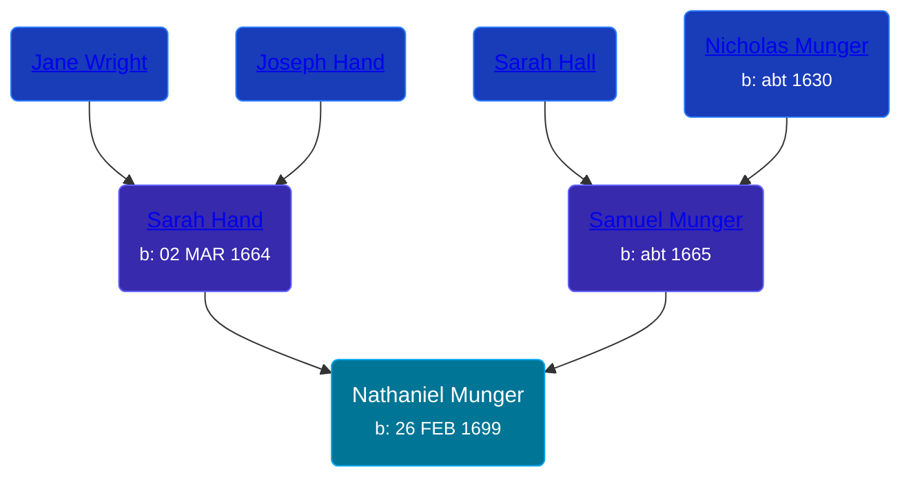

## 🔵 Nathaniel Munger

Son of [Samuel Munger](/people/5/57362828) and [Sarah Hand](/people/7/75255100)





### 📆 Events


Type | Date | Age at Event | Place
------ | ------ | ------ | ------
[Birth](#event-event-2) | 26 FEB 1699 |  | Guilford, Connecticut, USA



- **[Birth](#event-event-2)**
**Date**: 26 FEB 1699, Age:
**Place**: Guilford, Connecticut, USA


### 📰 Event Sources

####  Birth, 26 FEB 1699
* The Munger Book  - 203