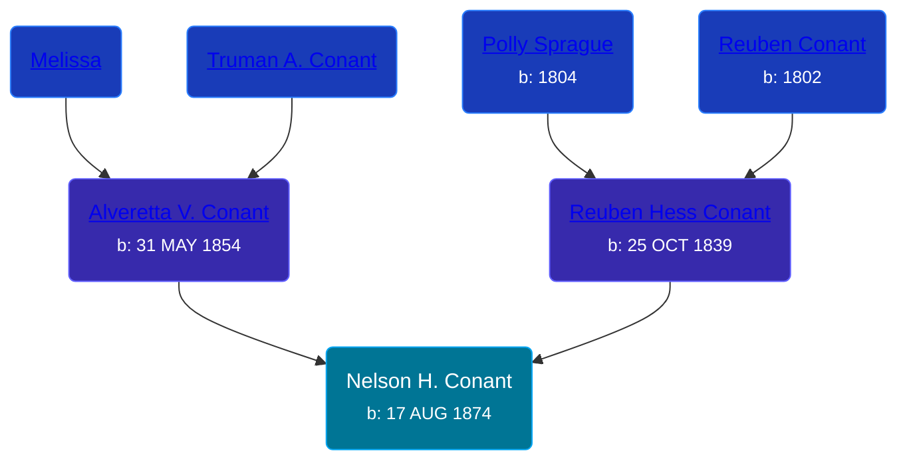

## 🔵 Nelson H. Conant
<small>Age: 67y, 1m, 21d</small>

Son of [Reuben Hess Conant](/people/3/37326838) and [Alveretta V. Conant](/people/6/60109856)





### 📆 Events


Type | Date | Age at Event | Place
------ | ------ | ------ | ------
[Birth](#event-event-2) | 17 AUG 1874 |  | Robinson Township, Ottawa, Michigan, USA
[Residence](#event-event-0) | June 1880 | 5y, 9m, 13d | Robinson Township, Ottawa, Michigan, USA
[Residence](#event-event-1) | 05 JUN 1900 | 25y, 9m, 18d | Robinson Township, Ottawa, Michigan, USA
[Residence](#event-event-2) | 09 APR 1910 | 35y, 7m, 22d | Grand Haven, Ottawa, Michigan, USA
[Residence](#event-event-3) | 03 JAN 1920 | 45y, 4m, 16d | Grand Haven, Ottawa, Michigan, USA
[Residence](#event-event-4) | 17 APR 1930 | 55y, 8m | Grand Haven, Ottawa, Michigan, USA
[Residence](#event-event-5) | 08 APR 1940 | 65y, 7m, 21d | Grand Haven, Ottawa, Michigan, USA
[Death](#event-event-9) | 08 OCT 1941 | 67y, 1m, 21d | Grand Haven, Ottawa, Michigan, USA



- **[Birth](#event-event-2)**
**Date**: 17 AUG 1874, Age:
**Place**: Robinson Township, Ottawa, Michigan, USA
- **[Residence](#event-event-0)**
**Date**: June 1880, Age: 5y, 9m, 13d
**Place**: Robinson Township, Ottawa, Michigan, USA
- **[Residence](#event-event-1)**
**Date**: 05 JUN 1900, Age: 25y, 9m, 18d
**Place**: Robinson Township, Ottawa, Michigan, USA
- **[Residence](#event-event-2)**
**Date**: 09 APR 1910, Age: 35y, 7m, 22d
**Place**: Grand Haven, Ottawa, Michigan, USA
- **[Residence](#event-event-3)**
**Date**: 03 JAN 1920, Age: 45y, 4m, 16d
**Place**: Grand Haven, Ottawa, Michigan, USA
- **[Residence](#event-event-4)**
**Date**: 17 APR 1930, Age: 55y, 8m
**Place**: Grand Haven, Ottawa, Michigan, USA
- **[Residence](#event-event-5)**
**Date**: 08 APR 1940, Age: 65y, 7m, 21d
**Place**: Grand Haven, Ottawa, Michigan, USA
- **[Death](#event-event-9)**
**Date**: 08 OCT 1941, Age: 67y, 1m, 21d
**Place**: Grand Haven, Ottawa, Michigan, USA


## 👩‍❤️‍👨 Relationships

### 🟣 [Mattie E. Parker](/people/9/92379008), b. 03 JUL 1884

#### Events


Type | Date | Age at Event | Place
------ | ------ | ------ | ------
[Marriage](#event-family-0-event-0) | 09 APR 1910 | 35y, 7m, 22d | Allendale, Ottawa, Michigan, USA



- **[Marriage](#event-family-0-event-0)**
**Date**: 09 APR 1910, Age: 35y, 7m, 22d
**Place**: Allendale, Ottawa, Michigan, USA


### 📰 Event Sources

####  Birth, 17 AUG 1874
* Michigan, Births and Christenings Index, 1867-1911
>   
  > Name:Nelson H Conant  
  > Gender:Male  
  > Birth Place:Ottawa, Michigan  
  > Birth Date:17 Aug 1874  
  > Baptism Place:Ottawa, Michigan  
  > Father's name:Reuben H Conant  
  > Mother's name:Alfreda  
  > FHL Film Number:984233

####  Residence, June 1880
* 1880 US Census

####  Residence, 05 JUN 1900
* 1900 US Census

####  Residence, 09 APR 1910
* 1910 US Census

####  Marriage, 09 APR 1910
* Michigan, Marriage Records, 1867-1952
>   
  > Name:Nelson H Conant  
  > Gender:Male  
  > Race:White  
  > Birth Year:abt 1874  
  > Birth Place:Robinson, Michigan  
  > Marriage Date:7 Nov 1902  
  > Marriage Place:Allendale, Ottawa, Michigan, USA  
  > Age:28  
  > Residence Place:Robinson Twp, Michigan  
  > Father:Rueben H Conan??  
  > Mother:Etta Conant  
  > Spouse:Mattie Parker  
  > Spouse Gender:Female  
  > Spouse Race:White  
  > Spouse Age:18  
  > Spouse Birth Place:Michigan  
  > Spouse Residence Place:Robinson Twp, Michigan  
  > Spouse Father:Wesley Parker  
  > Spouse Mother:Etta Crawford  
  > Record Number:282  
  > Film:75  
  > Film Description:1902 Kent - 1902 Saginaw

####  Residence, 03 JAN 1920
* 1920 US Census

####  Residence, 17 APR 1930
* 1930 US Census

####  Residence, 08 APR 1940
* 1940 US Census
####  Death, 08 OCT 1941
* Michigan Deaths, 1971-1996
>   
  > Name:Nelson Conant  
  > Gender:Male  
  > Race:White  
  > Marital status:Widowed  
  > Death Age:68  
  > Birth Date:17 Aug 1874  
  > Birth Place:Robinson Township Ottawa County  
  > Death Date:8 Oct 1942  
  > Death Place:Grand Haven, Ottawa, Michigan, USA  
  > File Number:001956  
  > Father:Reuben Hess Conant  
  > Mother:Alfretta Conant
