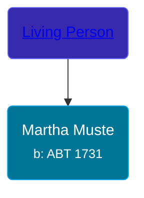

## 🟣 Martha Muste
<small>Age: 88y, 1m, 30d</small>

Daughter of [Living Person](/people/5/57944097)





### 📆 Events


Type | Date | Age at Event | Place
------ | ------ | ------ | ------
[Birth](#event-event-3) | ABT 1731 |  | Dreischor, Zeeland, Netherlands
[Death](#event-event-4) | 30 JAN 1819 | 88y, 1m, 30d | Dreischor, Zeeland, Netherlands



- **[Birth](#event-event-3)**
**Date**: ABT 1731, Age:
**Place**: Dreischor, Zeeland, Netherlands
- **[Death](#event-event-4)**
**Date**: 30 JAN 1819, Age: 88y, 1m, 30d
**Place**: Dreischor, Zeeland, Netherlands


## 👩‍❤️‍👨 Relationships

### 🔵 [Living Person](/people/2/25458048)

#### Children With Living Person
* 🔵 [Maarten Geelhoed](/people/3/33889936)
### 📰 Event Sources

####  Birth, ABT 1731
* Geelhoet, Geelhoed & Geelhoedt Genealogie  - 16

####  Death, 30 JAN 1819
* Geelhoet, Geelhoed & Geelhoedt Genealogie  - 16