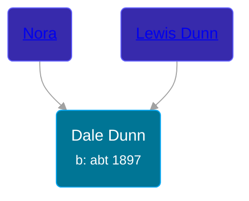

## 🔵 Dale Dunn

Son of [Lewis Dunn](/people/1/14066328) and [Nora ](/people/3/37580902)





### 📆 Events


Type | Date | Age at Event | Place
------ | ------ | ------ | ------
Birth | abt 1897 |  | Michigan, USA
[Residence](#event-event-0) | 12 APR 1930 | 33y, 4m, 12d | Rives, Jackson, Michigan, USA



- **Birth**
**Date**: abt 1897, Age:
**Place**: Michigan, USA
- **[Residence](#event-event-0)**
**Date**: 12 APR 1930, Age: 33y, 4m, 12d
**Place**: Rives, Jackson, Michigan, USA


### 📰 Event Sources

####  Residence, 12 APR 1930
* 1930 US Census
