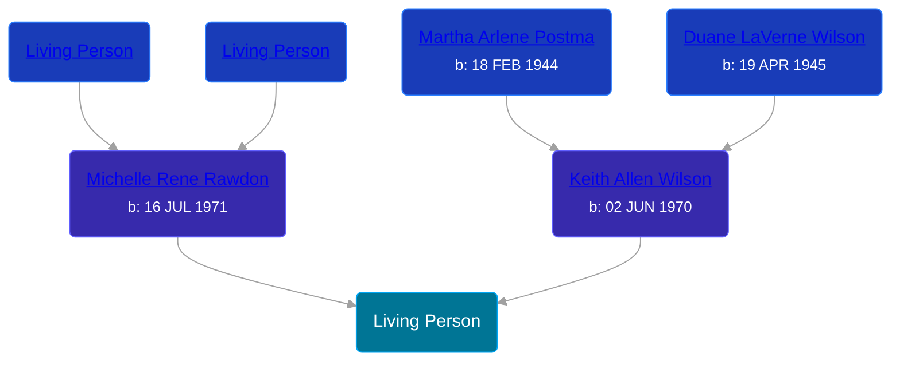

## 🟣 Living Person

Daughter of [Keith Allen Wilson](/people/3/37910144) and [Michelle Rene Rawdon](/people/1/18373170)





## 👩‍❤️‍👨 Relationships

### 🔵 [Living Person](/people/1/19815372)

#### Children With Living Person
* 🔵 [Living Person](/people/5/51388326)
### 🔵 [Living Person](/people/1/13480965)
