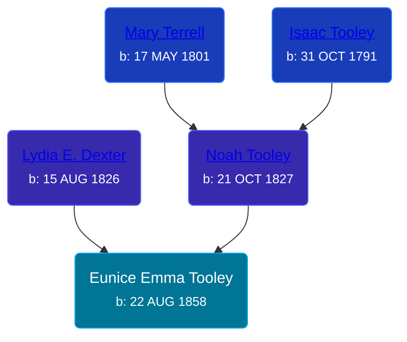

## 🟣 Eunice Emma Tooley
<small>Age: 82y, 7m, 15d</small>

Daughter of [Noah Tooley](/people/8/84640933) and [Lydia E. Dexter](/people/6/67357568)





### 📆 Events


Type | Date | Age at Event | Place
------ | ------ | ------ | ------
Birth | 22 AUG 1858 |  |
[Residence](#event-event-0) | 23 JUN 1860 | 1y, 10m, 1d | Paris Township, Kent, Michigan, USA
[Residence](#event-event-1) | 12 AUG 1870 | 11y, 11m, 20d | Paris Township, Kent, Michigan, USA
[Residence](#event-event-2) | 1880 | 21y, 3m, 8d | Paris Township, Kent, Michigan, USA
Death | 07 APR 1941 | 82y, 7m, 15d |
[Burial](#event-event-7) |  |  | Oak Grove Cemetery, Paris Township, Kent, Michigan, USA



- **Birth**
**Date**: 22 AUG 1858, Age:
**Place**:
- **[Residence](#event-event-0)**
**Date**: 23 JUN 1860, Age: 1y, 10m, 1d
**Place**: Paris Township, Kent, Michigan, USA
- **[Residence](#event-event-1)**
**Date**: 12 AUG 1870, Age: 11y, 11m, 20d
**Place**: Paris Township, Kent, Michigan, USA
- **[Residence](#event-event-2)**
**Date**: 1880, Age: 21y, 3m, 8d
**Place**: Paris Township, Kent, Michigan, USA
- **Death**
**Date**: 07 APR 1941, Age: 82y, 7m, 15d
**Place**:
- **[Burial](#event-event-7)**
**Date**:
**Place**: Oak Grove Cemetery, Paris Township, Kent, Michigan, USA


### 📰 Event Sources

####  Residence, 23 JUN 1860
* 1860 US Census

####  Residence, 12 AUG 1870
* 1870 US Census

####  Residence, 1880
* 1880 US Census

####  Burial
* Oak Grove Cemetery
>   
  > Tooley, Eunice  
  > b: 1858; d: 1941
