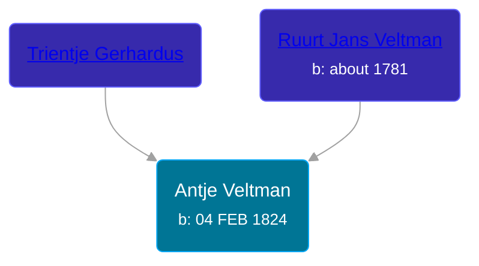

## 🟣 Antje Veltman

Daughter of [Ruurt Jans Veltman](/people/5/53462276) and [Trientje Gerhardus](/people/5/5258118)





### 📆 Events


Type | Date | Age at Event | Place
------ | ------ | ------ | ------
[Birth](#event-event-3) | 04 FEB 1824 |  | Tolbert, Netherlands



- **[Birth](#event-event-3)**
**Date**: 04 FEB 1824, Age:
**Place**: Tolbert, Netherlands


## 👩‍❤️‍👨 Relationships

### 🔵 [Jakob Eintes Postma](/people/4/46630400), b. 21 AUG 1827

#### Events


Type | Date | Age at Event | Place
------ | ------ | ------ | ------
[Marriage](#event-family-0-event-0) | 22 DEC 1849 | 25y, 10m, 18d | Achtkarspelen, Netherlands



- **[Marriage](#event-family-0-event-0)**
**Date**: 22 DEC 1849, Age: 25y, 10m, 18d
**Place**: Achtkarspelen, Netherlands


#### Children With Jakob Eintes Postma
* 🔵 [Hendrik Jakob Postma](/people/3/31727152), b. 27 FEB 1859
### 📰 Event Sources

####  Birth, 04 FEB 1824
* Dutch Civil Register
>   
  > Child: Antje Veltman  
  > Birth date: 04-02-1824  
  > Place of birth: Tolbert gem. Leek  
  > Gender: Vrouw  
  >   
  > Father: Ruurt Jans Veltman  
  > Profession: arbeider  
  > Age: 45 jaar  
  >   
  > Mother: Trientje Gerhardus  
  > Age: 38 jaar  
  >   
  > Event: Geboorte  
  > Event date: 04-02-1824  
  > Event place: Tolbert gem. Leek   
  >
####  Marriage, 22 DEC 1849
* Dutch Civil Register
>   
  > Source: Civil register - Marriage  
  > Archive location: Tresoar, Frysk Histoarysk en Letterkundich Sintrum  
  > General Number of finding aid: 30-01  
  > Item number: 2015  
  > Municipality: Achtkarspelen  
  > Type of record: Huwelijksakte  
  > Record number: 49  
  > Registration date: 22-12-1849  
  > Bridegroom: Jakob Eintes Postma  
  > Age: 22  
  > Place of birth: Surhuisterveen  
  > Bride: Antje Veltman  
  > Age: 25  
  > Place of birth: Tolbert, provincie Groningen  
  > Father bridegroom: Einte Wolters Postma  
  > Mother bridegroom: Riekeltje Jakobs Wagenaar  
  > Father bride: Ruurt Jans Veltman  
  > Mother bride: Trientje Gerhardus
