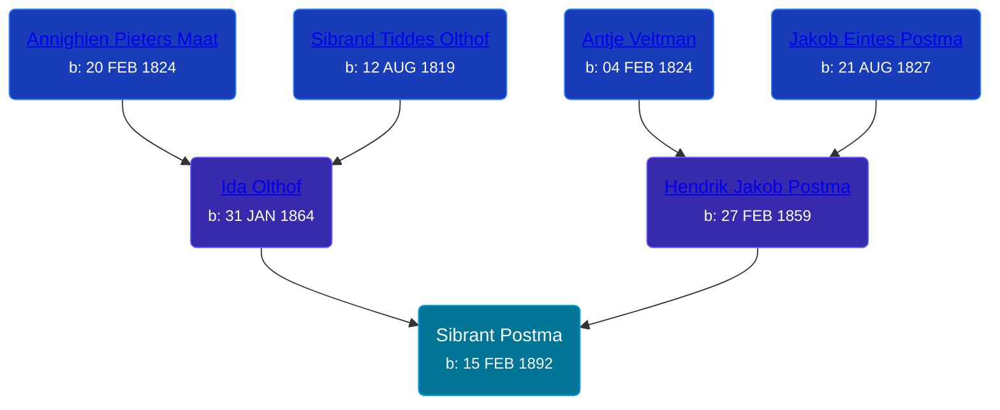

## 🔵 Sibrant Postma
<small>Age: 80y, 5m, 13d</small>

Son of [Hendrik Jakob Postma](/people/3/31727152) and [Ida Olthof](/people/6/60020862)





### 📆 Events


Type | Date | Age at Event | Place
------ | ------ | ------ | ------
[Birth](#event-event-3) | 15 FEB 1892 |  | Michigan, United States
[Residence](#event-event-0) | 1894 | 1y, 9m, 15d | Gaines Township, Kent, Michigan, USA
[Residence](#event-event-1) | 29 JUN 1900 | 8y, 4m, 14d | Gaines Township, Kent, Michigan, USA
[Residence](#event-event-2) | 1910 | 17y, 9m, 15d | Gaines Township, Kent, Michigan, USA
[Residence](#event-event-3) | 1930 | 37y, 9m, 15d | Grand Rapids, Kent, Michigan, United States
[Residence](#event-event-4) | 1940 | 47y, 9m, 15d | Grand Rapids, Kent, Michigan, United States
[Residence](#event-event-5) | 1942 | 49y, 9m, 15d | Grand Rapids, Kent, Michigan, United States
[Death](#event-event-10) | 28 JUL 1972 | 80y, 5m, 13d | Michigan, USA
Burial | 31 JUL 1972 | 80y, 5m, 16d | Pine Hill Cemetery, Kentwood, Kent, Michigan, USA



- **[Birth](#event-event-3)**
**Date**: 15 FEB 1892, Age:
**Place**: Michigan, United States
- **[Residence](#event-event-0)**
**Date**: 1894, Age: 1y, 9m, 15d
**Place**: Gaines Township, Kent, Michigan, USA
- **[Residence](#event-event-1)**
**Date**: 29 JUN 1900, Age: 8y, 4m, 14d
**Place**: Gaines Township, Kent, Michigan, USA
- **[Residence](#event-event-2)**
**Date**: 1910, Age: 17y, 9m, 15d
**Place**: Gaines Township, Kent, Michigan, USA
- **[Residence](#event-event-3)**
**Date**: 1930, Age: 37y, 9m, 15d
**Place**: Grand Rapids, Kent, Michigan, United States
- **[Residence](#event-event-4)**
**Date**: 1940, Age: 47y, 9m, 15d
**Place**: Grand Rapids, Kent, Michigan, United States
- **[Residence](#event-event-5)**
**Date**: 1942, Age: 49y, 9m, 15d
**Place**: Grand Rapids, Kent, Michigan, United States
- **[Death](#event-event-10)**
**Date**: 28 JUL 1972, Age: 80y, 5m, 13d
**Place**: Michigan, USA
- **Burial**
**Date**: 31 JUL 1972, Age: 80y, 5m, 16d
**Place**: Pine Hill Cemetery, Kentwood, Kent, Michigan, USA


### 📰 Event Sources

####  Birth, 15 FEB 1892
* U.S., World War II Draft Registration Cards, 1942
>   
  > Name: Sam Sibrant Postma  
  > Age: 0  
  > Birth Date: 15 Feb 1892  
  > Residence Year: 1942  
  > Residence: Grand Rapids, Michigan, USA

####  Residence, 1894
* 1894 Michigan State Census
>   
  > Name: Seben Postma  
  > Sex: Male  
  > Age: 2  
  > Residence Place: Gaines, Kent, Michigan, United States  
  > Relationship to Head of Household: Son  
  > Event Type: Census  
  > Event Place: Gaines, Kent, Michigan, United States  
  > Line Number: 13  
  > Page Number: 1  
  > Microfilm Number: 984658  
  > Indexing Batch: N04014-8

####  Residence, 29 JUN 1900
* 1900 US Census
>   
  > Name: Sibant Postma  
  > Sex: Male  
  > Age: 8  
  > Birth Date: February 1892  
  > Birthplace: Michigan  
  > Marital Status: Single  
  > Race: White  
  > Relationship to Head of Household: Son  
  > Father's Birthplace: Holland  
  > Mother's Birthplace: Holland  
  > Event Type: Census  
  > Event Date: 1900  
  > Event Place: Gaines Township, Kent, Michigan, United States  
  > Line Number: 15  
  > Sheet Letter: A  
  > Sheet Number: 13  
  > Affiliate Publication Number: T623

####  Residence, 1910
* 1910 US Census

####  Residence, 1930
* 1930 US Census

####  Residence, 1940
* 1940 US Census

####  Residence, 1942
* U.S., World War II Draft Registration Cards, 1942

####  Death, 28 JUL 1972
* The Grand Rapids Press  - 28 Jul 1972
>   
  > POSTMA -- Sam Postma, aged 80, of 1139 Bemis SE. passed away Friday, July 28, 1972. Surviving are a son Henry of Sparta; two daughters, Mrs.Harriet Bowman of Grand Rapids, Mrs. Raymond (Kathleen) VanZoren of Newberry, Mich., ten grandchildren, two great-grandchildren; two brothers, Peter and Charles both of Grand Rapids; two sisters, Mrs. William (Clara) Slager of Wyoming, Mrs. Richard (Jennie) Weaver of Dutton; a dear friend, Mrs. Sally Jacobs of Grand Rapids. Funeral services will be held Monday at 1 p.m. at the funeral chapel. Interment Pine Hill Cemetery.
* U.S., Social Security Death Index, 1935-2014
>   
  > Name: SAM POSTMA  
  > Born: 15 Feb 1892  
  > Died: Jul 1972  
  > Last Residence: 49506 (Grand Rapids, Kent, MI)  
  > Last Benefit: (none specified)  
  > SSN: ###-##-####  
  > Issued: Michigan
* Michigan Deaths, 1971-1996
>   
  > Name: Sam S Postma  
  > Birth Date: 12 Feb 1892  
  > Death Date: 28 Jul 1972  
  > Gender: Male  
  > Residence: Grand Rapids, Kent, Michigan  
  > Place of Death: Grand Rapids, Kent, Michigan
