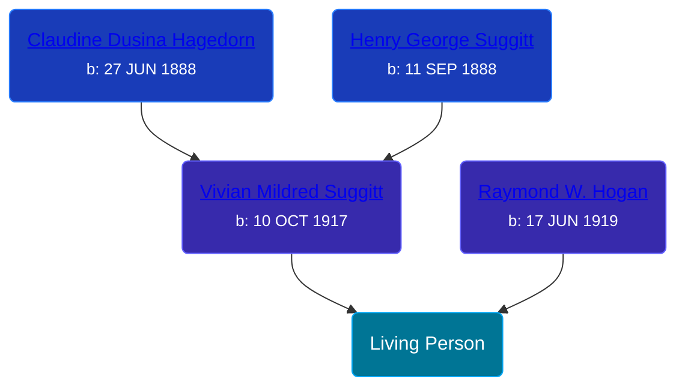

## 🔵 Living Person

Son of [Raymond W. Hogan](/people/7/7348108) and [Vivian Mildred Suggitt](/people/9/90213536)



```mermaid
graph
classDef grands fill:#193cb8,stroke:#2b7fff,stroke-width:1px,color:#fff;
classDef parents fill:#372aac,stroke:#615fff,stroke-width:1px,color:#fff;
classDef primary fill:#007595,stroke:#00a6f4,stroke-width:1px,color:#fff;
91001980(Living Person):::primary
90213536(<a class="text-white" href="/people/9/90213536">Vivian Mildred Suggitt</a><br /><small>b: 10 OCT 1917</small>):::parents-->91001980
21896640(<a class="text-white" href="/people/2/21896640">Claudine Dusina Hagedorn</a><br /><small>b: 27 JUN 1888</small>):::grands-->90213536
7271894(<a class="text-white" href="/people/7/7271894">Henry George Suggitt</a><br /><small>b: 11 SEP 1888</small>):::grands-->90213536
7348108(<a class="text-white" href="/people/7/7348108">Raymond W. Hogan</a><br /><small>b: 17 JUN 1919</small>):::parents-->91001980
```

