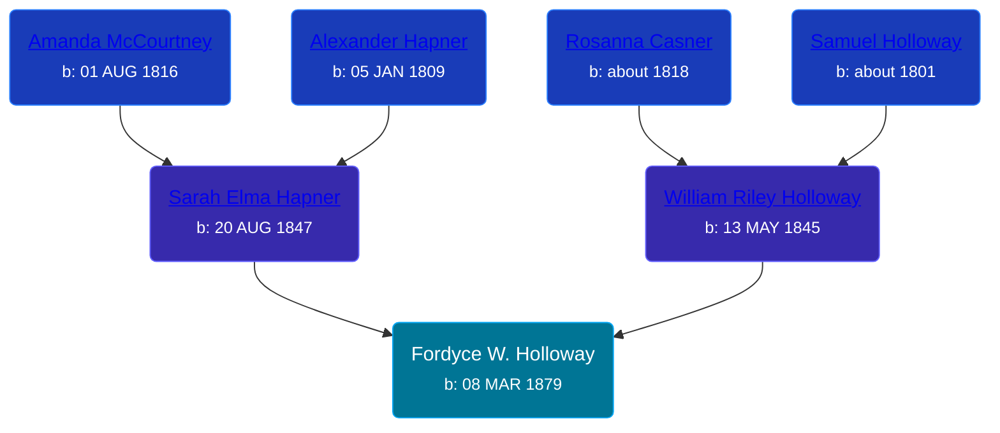

## 🔵 Fordyce W. Holloway
<small>Age: 18y, 4m, 23d</small>

Son of [William Riley Holloway](/people/9/90949012) and [Sarah Elma Hapner](/people/2/20173654)





### 📆 Events


Type | Date | Age at Event | Place
------ | ------ | ------ | ------
[Birth](#event-event-2) | 08 MAR 1879 |  | Chippewa Township, Isabella, Michigan, USA
[Death](#event-event-3) | 01 AUG 1897 | 18y, 4m, 23d | Deerfield Township, Isabella, Michigan, USA



- **[Birth](#event-event-2)**
**Date**: 08 MAR 1879, Age:
**Place**: Chippewa Township, Isabella, Michigan, USA
- **[Death](#event-event-3)**
**Date**: 01 AUG 1897, Age: 18y, 4m, 23d
**Place**: Deerfield Township, Isabella, Michigan, USA


### 📰 Event Sources

####  Birth, 08 MAR 1879
* Isabella County Birth Records
>   
  > Child No.: 1925  
  > Birth Date: Mar 8, 1879  
  > Name: Fordyce W. Holloway  
  > Sex: M  
  > Birth Place: Chippewa  
  > Father: William R. Holloway  
  > Mother: Sarah E. Holloway  
  > Residence: Chippewa  
  > Birth Place: Ohio  
  > Occupation of Father: Laborer  
  > Date of Record: May 15, 1880

####  Death, 01 AUG 1897
* Isabella County Death Records  - Volume II, 1897-1898
>   
  > No: 488  
  > DOD: Aug 1, 1897  
  > Name: Fordyce Holloway  
  > Sex: Male  
  > Marital Status: Single  
  > Years: 18  
  > Months: 4  
  > Days: 23  
  > Place of Death: Deerfield twp, Isabella Co., MI  
  > Cause: Chronic disease of the Kidneys  
  > Place of Birth: Michigan  
  > Occupation: Farmer  
  > Father: Wm Halloway & Sadie Halloway  
  > Residence: Michigan  
  > Date of Record: June 4, 1898
* Michigan, Deaths and Burials Index, 1867-1995
>   
  > Name: Fordyce Holloway  
  > Birth Date: abt 1879  
  > Birth Place: Michigan  
  > Death Date: 1 Aug 1897  
  > Death Place: Deerfield Twp., Isabella, Michigan  
  > Death Age: 18  
  > Race: White  
  > Marital Status: Single  
  > Gender: Male  
  > Father Name: Wm. Holloway  
  > Father Birth Place: Michigan  
  > Mother Name: Sadie Holloway  
  > Mother Birth Place: Michigan  
  > FHL Film Number: 1005119