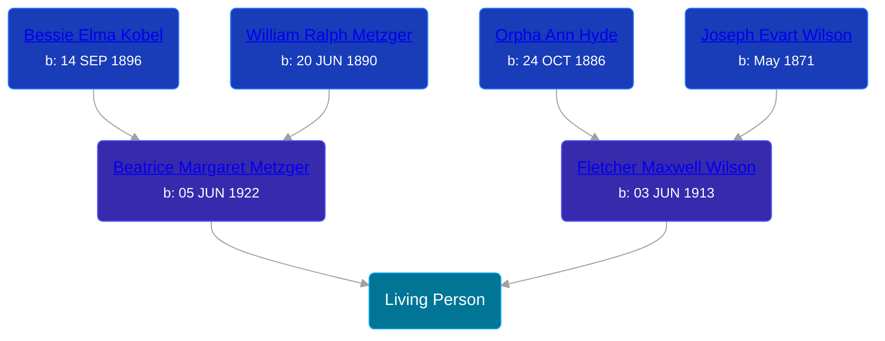

## 🟣 Living Person

Daughter of [Fletcher Maxwell Wilson](/people/3/32597724) and [Beatrice Margaret Metzger](/people/7/79763948)





## 👩‍❤️‍👨 Relationships

### 🔵 [Living Person](/people/2/26194004)

#### Children With Living Person
* 🔵 [Living Person](/people/4/40809017)
### 🔵 [Living Person](/people/8/84637541)

#### Children With Living Person
* 🔵 [Living Person](/people/3/315988)
* 🟣 [Living Person](/people/3/3566860)
* 🟣 [Living Person](/people/1/17102831)
* 🟣 [Living Person](/people/3/38033421)
### 🔵 [Dennis Quintin Hartley](/people/9/93762606), b. 21 JUN 1950
