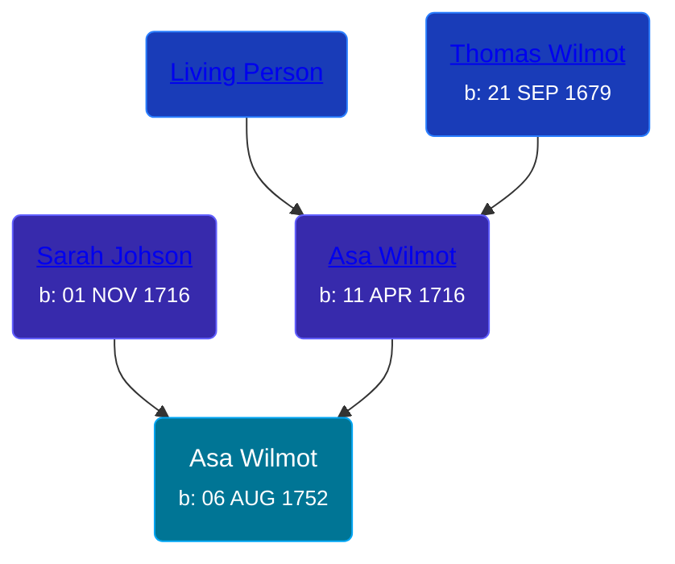

## 🔵 Asa Wilmot
<small>Age: 51y, 3m, 24d</small>

Son of [Asa Wilmot](/people/1/15735504) and [Sarah Johson](/people/4/48968878)





### 📆 Events


Type | Date | Age at Event | Place
------ | ------ | ------ | ------
[Birth](#event-event-2) | 06 AUG 1752 |  |
[Death](#event-event-3) | 1804 | 51y, 3m, 24d | Cheshire, New Haven, Connecticut



- **[Birth](#event-event-2)**
**Date**: 06 AUG 1752, Age:
**Place**:
- **[Death](#event-event-3)**
**Date**: 1804, Age: 51y, 3m, 24d
**Place**: Cheshire, New Haven, Connecticut


### 📰 Event Sources

####  Birth, 06 AUG 1752
* The New England Historical and Genealogical Register  - 73

####  Death, 1804
* The New England Historical and Genealogical Register  - 73