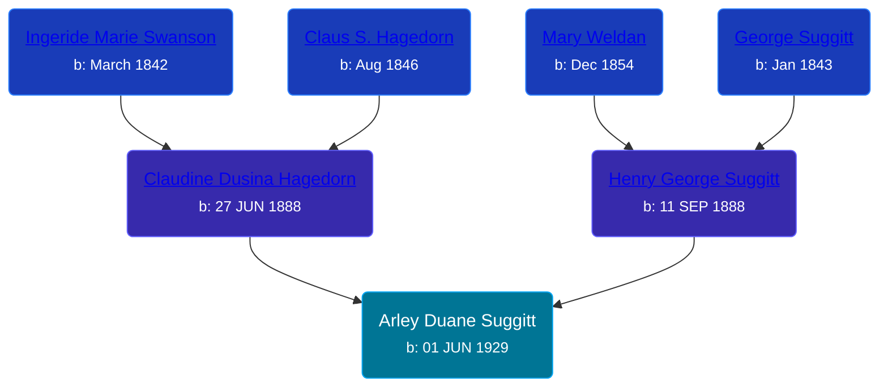

## 🔵 Arley Duane Suggitt
<small>Age: 88y, 6m, 26d</small>

Son of [Henry George Suggitt](/people/7/7271894) and [Claudine Dusina Hagedorn](/people/2/21896640)





### 📆 Events


Type | Date | Age at Event | Place
------ | ------ | ------ | ------
[Birth](#event-event-2) | 01 JUN 1929 |  | Clay Township, Clay, Iowa, USA
[Residence](#event-event-0) | 09 APR 1930 | 10m, 8d | Royal Town, Clay, Iowa, USA
[Baptism](#event-event-1) | 29 OCT 1930 | 1y, 4m, 28d | Rolfe, Iowa, USA
[Death](#event-event-5) | 27 DEC 2017 | 88y, 6m, 26d | Sioux City, Woodbury, Iowa, USA
Burial |  |  | Memorial Park Cemetery, Sioux City, Woodbury, Iowa, USA



- **[Birth](#event-event-2)**
**Date**: 01 JUN 1929, Age:
**Place**: Clay Township, Clay, Iowa, USA
- **[Residence](#event-event-0)**
**Date**: 09 APR 1930, Age: 10m, 8d
**Place**: Royal Town, Clay, Iowa, USA
- **[Baptism](#event-event-1)**
**Date**: 29 OCT 1930, Age: 1y, 4m, 28d
**Place**: Rolfe, Iowa, USA
- **[Death](#event-event-5)**
**Date**: 27 DEC 2017, Age: 88y, 6m, 26d
**Place**: Sioux City, Woodbury, Iowa, USA
- **Burial**
**Date**:
**Place**: Memorial Park Cemetery, Sioux City, Woodbury, Iowa, USA


## 👩‍❤️‍👨 Relationships

### 🟣 [Living Person](/people/8/835290)

### 🟣 [Patricia Jane Jordan](/people/8/8578400), b. 14 JAN 1936

#### Children With Patricia Jane Jordan
* 🔵 [Living Person](/people/2/25836418)
* 🔵 [Living Person](/people/6/66289520)
* 🔵 [Living Person](/people/6/6498027)
* 🔵 [Living Person](/people/1/17261472)
* 🔵 [Living Person](/people/6/63194399)
* 🟣 [Living Person](/people/1/19693317)
* 🟣 [Renee Hichelle Suggitt](/people/4/42597908), b. 01 FEB 1964
### 📰 Event Sources

####  Birth, 01 JUN 1929
* Iowa, Births and Christenings Index, 1857-1947  - 1434999

####  Residence, 09 APR 1930
* 1930 US Census

####  Baptism, 29 OCT 1930
* U.S., Evangelical Lutheran Church of America, Records, 1875-1940
>   
  > Name:Arley Puane Suggitt  
  > Event Type:Baptism  
  > Birth Date:1 Jun 1929  
  > Baptism Date:29 Oct 1930  
  > Baptism Place:Rolfe, Iowa  
  > Father:Henry Suggitt  
  > Mother:Claudine Suggitt  
  > Church Name:Nain  
  > Church Location:Rolfe, Iowa

####  Death, 27 DEC 2017
* Sioux City Journal
>   
  > Arley D. Suggit  
  >   
  > Sioux City  
  >   
  > 88, died Wednesday, Dec. 27, 2017. Service: Jan. 3 at 10:30 a.m., Trinity Lutheran Church. Burial: Memorial Park Cemetery. Visitation: Jan. 2 from 5 to 8 p.m., at the church. Meyer Brothers Colonial Chapel.
* Meyer Brothers Chappels
>   
  > Arley D. Suggitt, 88 of Sioux City, went home to be with his Lord and Savior at his residence on Wednesday, December 27, 2017 surrounded by his family after a courageous battle with alzaeimers. Funeral Services will be at 10:30 a.m. Wednesday, January 3, 2018 at Trinity Lutheran Church with Reverend R. Paul Johnston officiating. Burial will be at Memorial Park Cemetery. Visitation will be on Tuesday, January 2nd at the church, from 5:00 p.m. until 8:00 p.m. with a Prayer Service beginning at 7:00 p.m. Online condolences may be offered to the family at www.meyerbroschapels.com   
  >   
  > Arley was born June 1st, 1929 in Royal, IA. The son of Henry & Claudine Suggitt. He graduated from Central High School in 1948, and he served in the Korean War 1949-1951. Arley was a memeber of Trinity Luthern Church and served on church council. He was a carpenter and retired from Chris Hanson Construction after 35 years of service.   
  >   
  > Arley was an avid Iowa Hawkeye fan. In his spare time he enjoyed golfing, riding his motorcycle, and spending time with his family.   
  >   
  > He is survived by his wife Jenice Suggitt, and step children Joni Martin, Renae (Ed) Madison, Ed (Linda) Rohmiller, Joe (Kristine) Ensminger; (from a previous marriage) children, Randy (Debra) Suggitt, Rob (Gloria) Suggitt, Rhonda (Randy) Coleman, Rod (Sandy) Suggitt, Russ Suggitt; and numerous grandchildren, & great grandchildren.   
  >   
  > He is preceded in to death by son Rick Suggitt, daughter Renee Suggitt, sisters, Vivian Hogan, Doris Beacom and Erma Moss   
  >   
  > Pall Bearers will be his grandsons   
  >   
  > Our family would like to extend a Special Thank You to the Hospice of Siouxland Staff.
