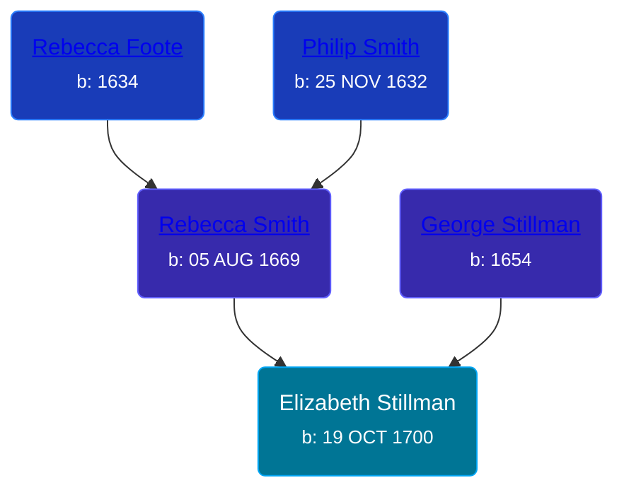

## 🟣 Elizabeth Stillman

Daughter of [George Stillman](/people/6/67040632) and [Rebecca Smith](/people/7/76162584)





### 📆 Events


Type | Date | Age at Event | Place
------ | ------ | ------ | ------
[Birth](#event-event-2) | 19 OCT 1700 |  | Hadley, Massachusetts, USA



- **[Birth](#event-event-2)**
**Date**: 19 OCT 1700, Age:
**Place**: Hadley, Massachusetts, USA


### 📰 Event Sources

####  Birth, 19 OCT 1700
* The Foote Family: or the Descendants of Nathaniel Foote  - 280