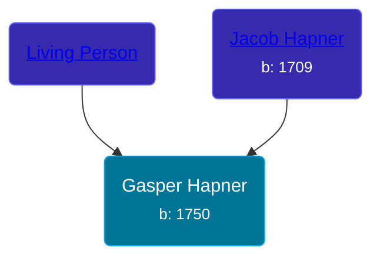

## 🔵 Gasper Hapner
<small>Age: 64y, 3m, 4d</small>

Son of [Jacob Hapner](/people/3/31698804) and [Living Person](/people/2/23759173)





### 📆 Events


Type | Date | Age at Event | Place
------ | ------ | ------ | ------
Birth | 1750 |  | Pennsylvania, USA
Death | 04 MAR 1814 | 64y, 3m, 4d | Preble, Ohio, USA



- **Birth**
**Date**: 1750, Age:
**Place**: Pennsylvania, USA
- **Death**
**Date**: 04 MAR 1814, Age: 64y, 3m, 4d
**Place**: Preble, Ohio, USA


## 👩‍❤️‍👨 Relationships

### 🟣 [Living Person](/people/7/78872424)

#### Children With Living Person
* 🔵 [William Henry Hapner](/people/9/95017783), b. 1775