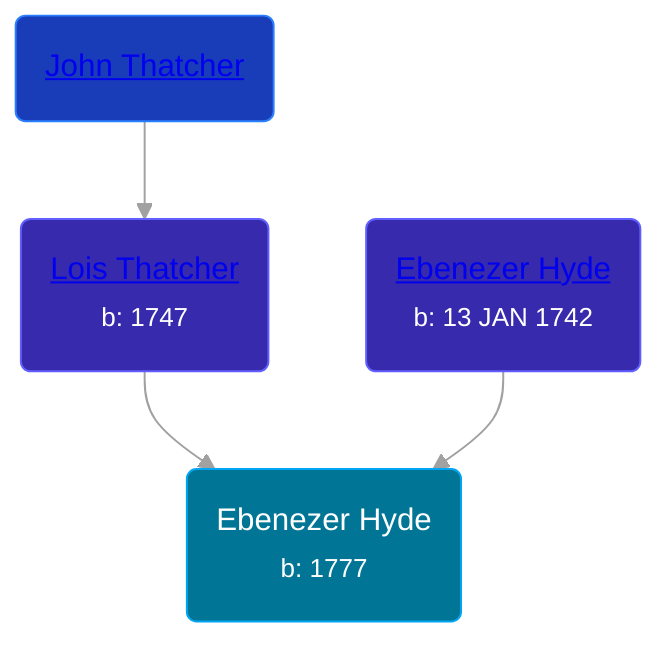

## 🔵 Ebenezer Hyde
<small>Age: 81y, 2m, 5d</small>

Son of [Ebenezer Hyde](/people/1/14535025) and [Lois Thatcher](/people/9/92113144)





### 📆 Events


Type | Date | Age at Event | Place
------ | ------ | ------ | ------
[Birth](#event-event-2) | 1777 |  | Vermont, USA
[Death](#event-event-3) | 05 FEB 1858 | 81y, 2m, 5d |



- **[Birth](#event-event-2)**
**Date**: 1777, Age:
**Place**: Vermont, USA
- **[Death](#event-event-3)**
**Date**: 05 FEB 1858, Age: 81y, 2m, 5d
**Place**:


## 👩‍❤️‍👨 Relationships

### 🟣 [Jane Holcomb](/people/4/45834912), b. 1787

### 📰 Event Sources

####  Birth, 1777
* The Hyde Ancestors of Lawrence Hyde, 1888-1960
* Allegany County and It's People  - 70

####  Death, 05 FEB 1858
* The Hyde Ancestors of Lawrence Hyde, 1888-1960