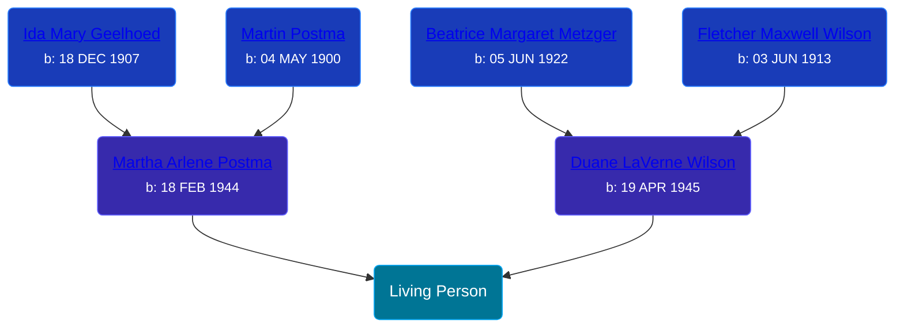

## 🟣 Living Person

Daughter of [Duane LaVerne Wilson](/people/6/61086158) and [Martha Arlene Postma](/people/3/39368292)





## 👩‍❤️‍👨 Relationships

### 🔵 [John Edward Mahoney](/people/2/20318131), b. 11 NOV 1961

#### Children With John Edward Mahoney
* 🔵 [Living Person](/people/4/4287670)
### 🔵 [Living Person](/people/7/7769050)

#### Children With Living Person
* 🔵 [Living Person](/people/5/55580943)