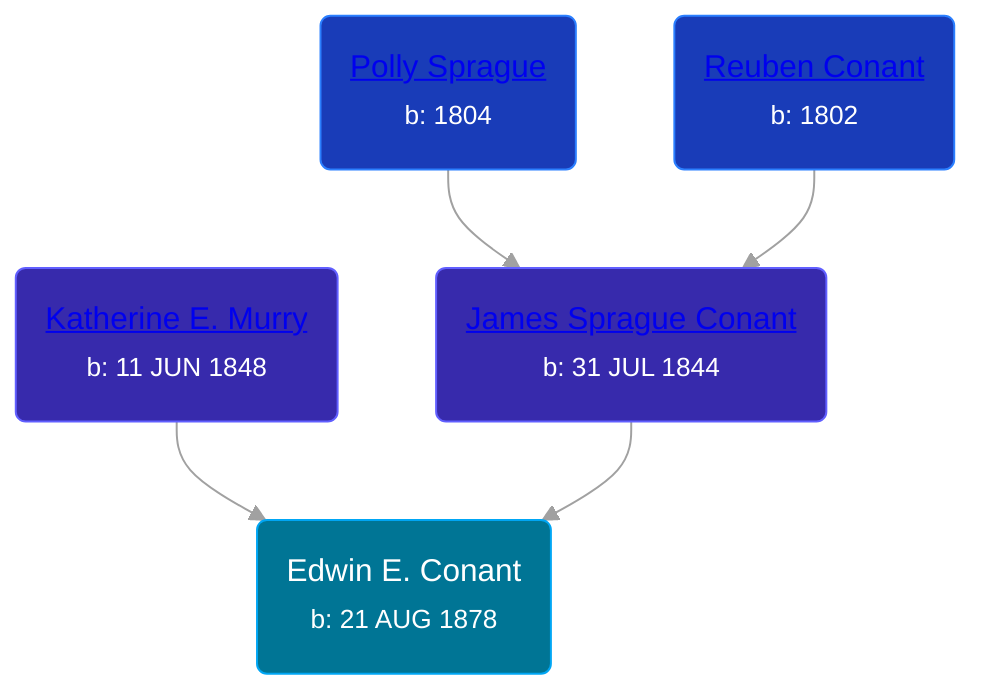

## 🔵 Edwin E. Conant
<small>Age: 24y, 1m, 22d</small>

Son of [James Sprague Conant](/people/6/62404416) and [Katherine E. Murry](/people/2/25746290)





### 📆 Events


Type | Date | Age at Event | Place
------ | ------ | ------ | ------
Birth | 21 AUG 1878 |  | Michigan, USA
[Residence](#event-event-0) | 1880 | 1y, 3m, 9d | Robinson Township, Ottawa, Michigan, USA
[Residence](#event-event-1) | 1900 | 21y, 3m, 9d | Robinson Township, Ottawa, Michigan, USA
[Death](#event-event-5) | 13 OCT 1902 | 24y, 1m, 22d | Michigan, USA
[Burial](#event-event-6) |  |  | Robinson Township Cemetery, Robinson Township, Ottawa, Michigan, USA



- **Birth**
**Date**: 21 AUG 1878, Age:
**Place**: Michigan, USA
- **[Residence](#event-event-0)**
**Date**: 1880, Age: 1y, 3m, 9d
**Place**: Robinson Township, Ottawa, Michigan, USA
- **[Residence](#event-event-1)**
**Date**: 1900, Age: 21y, 3m, 9d
**Place**: Robinson Township, Ottawa, Michigan, USA
- **[Death](#event-event-5)**
**Date**: 13 OCT 1902, Age: 24y, 1m, 22d
**Place**: Michigan, USA
- **[Burial](#event-event-6)**
**Date**:
**Place**: Robinson Township Cemetery, Robinson Township, Ottawa, Michigan, USA


### 📰 Event Sources

####  Residence, 1880
* 1880 US Census

####  Residence, 1900
* 1900 US Census

####  Death, 13 OCT 1902
* Michigan Death Certificates

####  Burial
* Robinson Township Cemetery
>   
  > Conant, Edmond  
  > b: Aug. 21, 1878; d: Oct. 13, 1902
