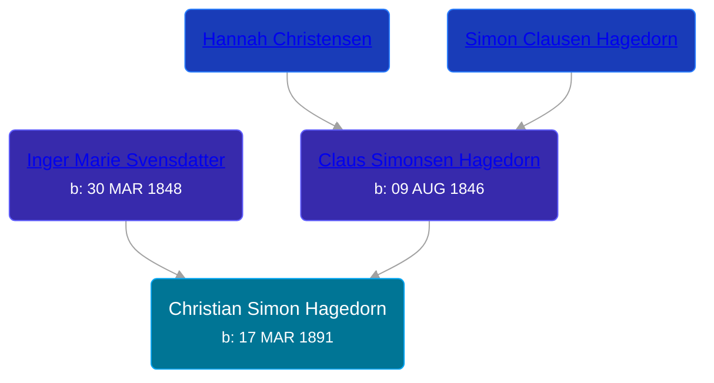

## 🔵 Christian Simon Hagedorn

Son of [Claus Simonsen Hagedorn](/people/8/89695136) and [Inger Marie Svensdatter](/people/4/41786466)





### 📆 Events


Type | Date | Age at Event | Place
------ | ------ | ------ | ------
[Birth](#event-event-2) | 17 MAR 1891 |  | Holstein, Germany
[Immigration](#event-event-0) | 1897 | 5y, 8m, 13d | USA
[Residence](#event-event-1) | 12 JUN 1900 | 9y, 2m, 25d | Peterson Township, Clay, Iowa, USA
[Residence](#event-event-2) | 15 APR 1910 | 19y, 28d | Douglas, Clay, Iowa, USA



- **[Birth](#event-event-2)**
**Date**: 17 MAR 1891, Age:
**Place**: Holstein, Germany
- **[Immigration](#event-event-0)**
**Date**: 1897, Age: 5y, 8m, 13d
**Place**: USA
- **[Residence](#event-event-1)**
**Date**: 12 JUN 1900, Age: 9y, 2m, 25d
**Place**: Peterson Township, Clay, Iowa, USA
- **[Residence](#event-event-2)**
**Date**: 15 APR 1910, Age: 19y, 28d
**Place**: Douglas, Clay, Iowa, USA


### 📰 Event Sources

####  Birth, 17 MAR 1891
* U.S., World War I Draft Registration Cards, 1917-1918

####  Immigration, 1897
* 1900 US Census

####  Residence, 12 JUN 1900
* 1900 US Census

####  Residence, 15 APR 1910
* 1910 US Census