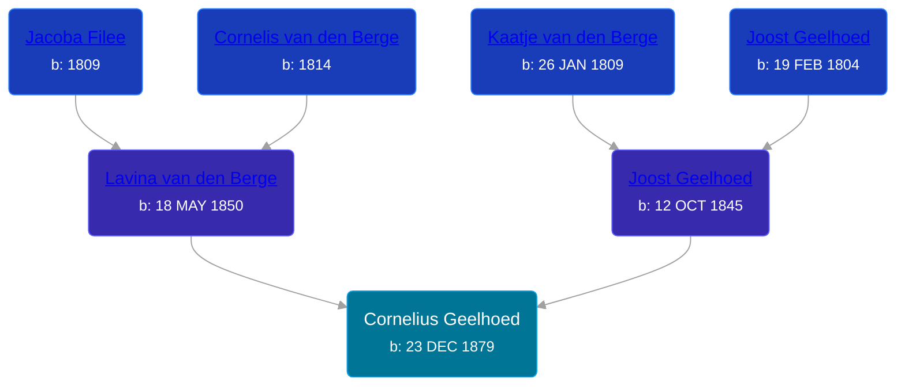

## 🔵 Cornelius Geelhoed
<small>Age: 58y, 6m, 29d</small>

Son of [Joost Geelhoed](/people/7/73673934) and [Lavina van den Berge](/people/7/71558365)





### 📆 Events


Type | Date | Age at Event | Place
------ | ------ | ------ | ------
[Birth](#event-event-2) | 23 DEC 1879 |  | Dreischor, Zeeland, Netherlands
[Immigration](#event-event-0) | 17 MAY 1881 | 1y, 4m, 24d | New York, New York, United States
[Residence](#event-event-1) | 06 JUL 1900 | 20y, 6m, 13d | Paris Township, Kent, Michigan, USA
[Residence](#event-event-2) | 22 APR 1910 | 30y, 3m, 29d | Paris Township, Kent, Michigan, USA
[Residence](#event-event-3) | 1920 | 40y, -1m, 7d | Paris Township, Kent, Michigan, USA
[Residence](#event-event-4) | 1930 | 50y, -1m, 7d | Cascade, Kent, Michigan, USA
[Death](#event-event-8) | 22 JUL 1938 | 58y, 6m, 29d | Grand Rapids, Kent, Michigan, United States
[Burial](#event-event-9) |  |  | Pine Hill Cemetery



- **[Birth](#event-event-2)**
**Date**: 23 DEC 1879, Age:
**Place**: Dreischor, Zeeland, Netherlands
- **[Immigration](#event-event-0)**
**Date**: 17 MAY 1881, Age: 1y, 4m, 24d
**Place**: New York, New York, United States
- **[Residence](#event-event-1)**
**Date**: 06 JUL 1900, Age: 20y, 6m, 13d
**Place**: Paris Township, Kent, Michigan, USA
- **[Residence](#event-event-2)**
**Date**: 22 APR 1910, Age: 30y, 3m, 29d
**Place**: Paris Township, Kent, Michigan, USA
- **[Residence](#event-event-3)**
**Date**: 1920, Age: 40y, -1m, 7d
**Place**: Paris Township, Kent, Michigan, USA
- **[Residence](#event-event-4)**
**Date**: 1930, Age: 50y, -1m, 7d
**Place**: Cascade, Kent, Michigan, USA
- **[Death](#event-event-8)**
**Date**: 22 JUL 1938, Age: 58y, 6m, 29d
**Place**: Grand Rapids, Kent, Michigan, United States
- **[Burial](#event-event-9)**
**Date**:
**Place**: Pine Hill Cemetery


## 👩‍❤️‍👨 Relationships

### 🟣 [Clara E. Terrell](/people/6/62490094), b. 07 NOV 1883

#### Events


Type | Date | Age at Event | Place
------ | ------ | ------ | ------
[Marriage](#event-family-0-event-0) | 06 AUG 1903 | 23y, 7m, 13d | Grand Rapids, Kent, Michigan, United States



- **[Marriage](#event-family-0-event-0)**
**Date**: 06 AUG 1903, Age: 23y, 7m, 13d
**Place**: Grand Rapids, Kent, Michigan, United States


#### Children With Clara E. Terrell
* 🟣 [Lavina Geelhoed](/people/6/61172656), b. 01 DEC 1905
* 🟣 [Ida Mary Geelhoed](/people/1/11612484), b. 18 DEC 1907
* 🟣 [Katherine Geelhoed](/people/9/97434011), b. 02 JUN 1910
* 🔵 [Joseph Geelhoed](/people/1/15410559), b. 26 NOV 1912
* 🟣 [Mary Ann Geelhoed](/people/6/6202111), b. 08 FEB 1916
* 🟣 [Ella May Geelhoed](/people/7/77129056), b. 12 OCT 1918
* 🔵 [Cora L. Geelhoed](/people/9/92397342), b. 13 MAR 1921
* 🔵 [Cornelius Geelhoed](/people/7/7469384), b. 07 MAR 1923
* 🔵 [Raymond Geelhood](/people/9/98188250), b. 30 DEC 1924
## 📝 Notes
>   
  > Cornelius' gravestone says he was born in 1879, his draft card says 28Dec 1880, and the 1900 census record shows his birth as Dec 1879. I have taken the liberty to assume his birthdate as 28 Dec 1879.
### 📰 Event Sources

####  Birth, 23 DEC 1879
* Geelhoet, Geelhoed & Geelhoedt Genealogie  - 142
* Netherlands, Birth Index, 1784-1917
>   
  > Name: Cornelis Geelhoed  
  > Birth Date: 28 Dec 1879  
  > Birth Place: Dreischor  
  > Father: Joost Geelhoed  
  > Mother: Levina van den Berge

####  Immigration, 17 MAY 1881
* New York, Passenger Lists, 1820-1957
>   
  > Name: Cornelis Geelhoed  
  > Arrival Date: 17 May 1881  
  > Birth Date: abt 1880  
  > Age: 1 3/12  
  > Gender: Male  
  > Ethnicity/ Nationality: Netherlander (Dutch)  
  > Place of Origin: Netherlands  
  > Port of Departure: Rotterdam, Netherlands  
  > Destination: United States of America  
  > Port of Arrival: New York, New York  
  > Ship Name: Maas

####  Residence, 06 JUL 1900
* 1900 US Census

####  Residence, 22 APR 1910
* 1910 US Census

####  Residence, 1920
* 1920 US Census

####  Residence, 1930
* 1930 US Census

####  Death, 22 JUL 1938
* The Grand Rapids Press
* Geelhoet, Geelhoed & Geelhoedt Genealogie  - 142

####  Burial
* Pine Hill Cemetery, Personal Visit
>   
  > Geelhoed, Cornelius  
  > b: 1879; d: 1938
####  Marriage, 06 AUG 1903
* Kent County Marriage Records  - Book 13, Page 267, Record 3885
>   
  > Date of Record: 6 Aug 1903  
  > Date of Marriage: 6 Aug 1903  
  > Place of Marriage: Grand Rapids, Kent County, Michigan  
  > Groom: Cornelius Geelhood  
  > Bride: Clara Terrell  
  > Groom's Birthplace: Netherlands  
  > Groom's Parents: Joe Geelhoed and S. Vandenberg  
  > Groom's Prev. Marriages: 0  
  > Bride's Birthplace: Paris Township, Kent County, Michigan  
  > Bride's Parents: K. Terrell and Unknown  
  > Bride's Prev. Marriages: 0
