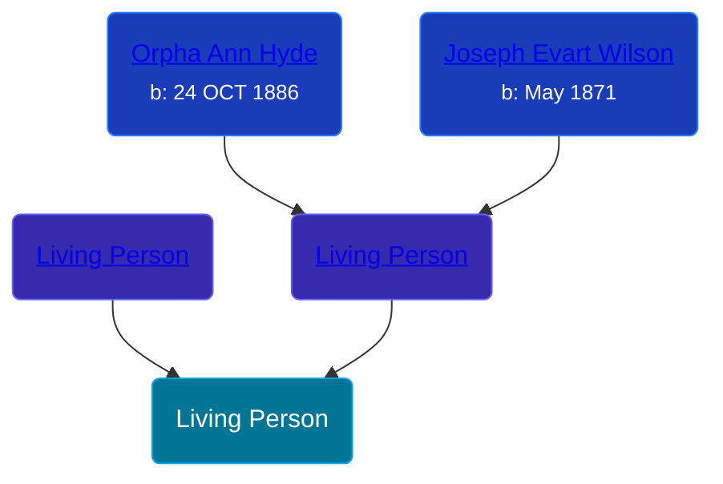

## 🔵 Living Person

Son of [Living Person](/people/3/35616804) and [Living Person](/people/7/72945090)



```mermaid
graph
classDef grands fill:#193cb8,stroke:#2b7fff,stroke-width:1px,color:#fff;
classDef parents fill:#372aac,stroke:#615fff,stroke-width:1px,color:#fff;
classDef primary fill:#007595,stroke:#00a6f4,stroke-width:1px,color:#fff;
92908178(Living Person):::primary
72945090(<a class="text-white" href="/people/7/72945090">Living Person</a>):::parents-->92908178
35616804(<a class="text-white" href="/people/3/35616804">Living Person</a>):::parents-->92908178
63932813(<a class="text-white" href="/people/6/63932813">Orpha Ann Hyde</a><br /><small>b: 24 OCT 1886</small>):::grands-->35616804
57306025(<a class="text-white" href="/people/5/57306025">Joseph Evart Wilson</a><br /><small>b: May 1871</small>):::grands-->35616804
```

