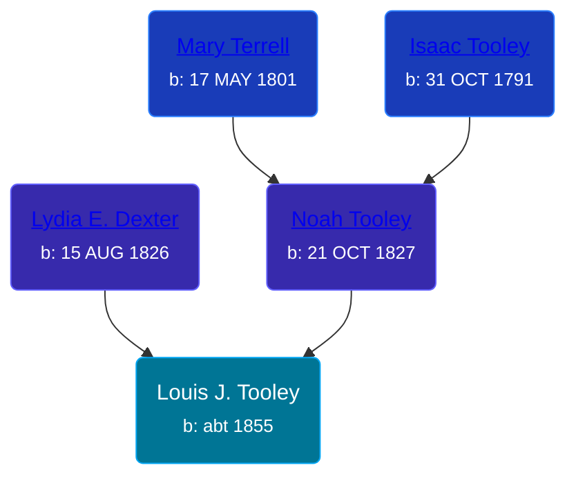

## 🔵 Louis J. Tooley

Son of [Noah Tooley](/people/8/84640933) and [Lydia E. Dexter](/people/6/67357568)





### 📆 Events


Type | Date | Age at Event | Place
------ | ------ | ------ | ------
Birth | abt 1855 |  |
[Residence](#event-event-0) | 23 JUN 1860 | 5y, 6m, 23d | Paris Township, Kent, Michigan, USA
[Residence](#event-event-1) | 12 AUG 1870 | 15y, 8m, 12d | Paris Township, Kent, Michigan, USA



- **Birth**
**Date**: abt 1855, Age:
**Place**:
- **[Residence](#event-event-0)**
**Date**: 23 JUN 1860, Age: 5y, 6m, 23d
**Place**: Paris Township, Kent, Michigan, USA
- **[Residence](#event-event-1)**
**Date**: 12 AUG 1870, Age: 15y, 8m, 12d
**Place**: Paris Township, Kent, Michigan, USA


### 📰 Event Sources

####  Residence, 23 JUN 1860
* 1860 US Census

####  Residence, 12 AUG 1870
* 1870 US Census
