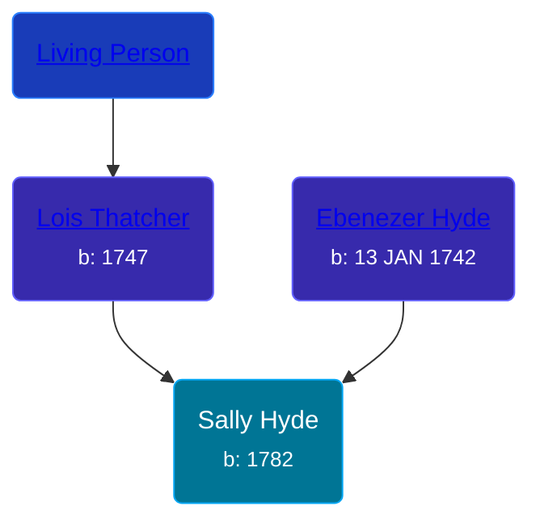

## 🟣 Sally Hyde
<small>Age: 80y</small>

Daughter of [Ebenezer Hyde](/people/1/14535025) and [Lois Thatcher](/people/9/92113144)





### 📆 Events


Type | Date | Age at Event | Place
------ | ------ | ------ | ------
[Birth](#event-event-2) | 1782 |  |
[Death](#event-event-3) | 1862 | 80y | Kalamazoo, Kalamazoo, Michigan, USA



- **[Birth](#event-event-2)**
**Date**: 1782, Age:
**Place**:
- **[Death](#event-event-3)**
**Date**: 1862, Age: 80y
**Place**: Kalamazoo, Kalamazoo, Michigan, USA


## 👩‍❤️‍👨 Relationships

### 🔵 [Abraham Aldrich](/people/2/23719788), b. 1775

### 📰 Event Sources

####  Birth, 1782
* The Hyde Ancestors of Lawrence Hyde, 1888-1960

####  Death, 1862
* The Hyde Ancestors of Lawrence Hyde, 1888-1960