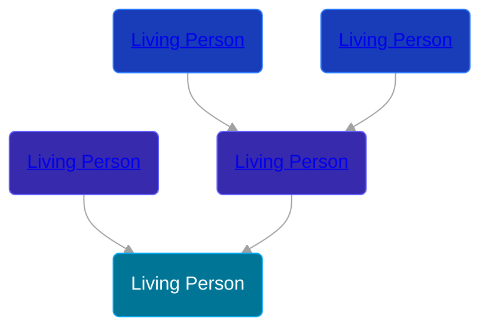

## 🔵 Living Person

Son of [Living Person](/people/2/27255579) and [Living Person](/people/9/97672136)





## 👩‍❤️‍👨 Relationships

### 🟣 [Living Person](/people/5/59264416)

#### Children With Living Person
* 🔵 [Living Person](/people/7/79817496)