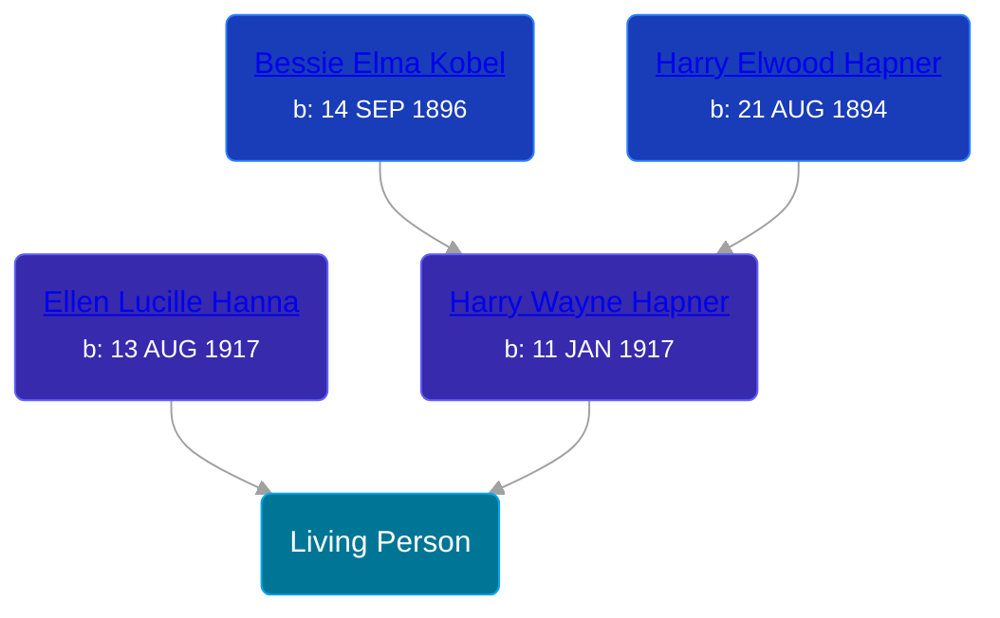

## 🔵 Living Person

Son of [Harry Wayne Hapner](/people/9/97595740) and [Ellen Lucille Hanna](/people/8/84629904)



```mermaid
graph
classDef grands fill:#193cb8,stroke:#2b7fff,stroke-width:1px,color:#fff;
classDef parents fill:#372aac,stroke:#615fff,stroke-width:1px,color:#fff;
classDef primary fill:#007595,stroke:#00a6f4,stroke-width:1px,color:#fff;
94321954(Living Person):::primary
84629904(<a class="text-white" href="/people/8/84629904">Ellen Lucille Hanna</a><br /><small>b: 13 AUG 1917</small>):::parents-->94321954
97595740(<a class="text-white" href="/people/9/97595740">Harry Wayne Hapner</a><br /><small>b: 11 JAN 1917</small>):::parents-->94321954
34277096(<a class="text-white" href="/people/3/34277096">Bessie Elma Kobel</a><br /><small>b: 14 SEP 1896</small>):::grands-->97595740
540(<a class="text-white" href="/people/5/540">Harry Elwood Hapner</a><br /><small>b: 21 AUG 1894</small>):::grands-->97595740
linkStyle default stroke:#a1a1a1
```


## 👩‍❤️‍👨 Relationships

### 🟣 [Living Person](/people/4/43227408)
