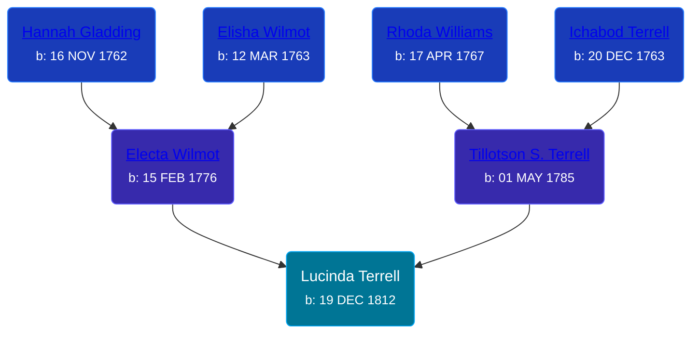

## 🟣 Lucinda Terrell

Daughter of [Tillotson S. Terrell](/people/2/25548435) and [Electa Wilmot](/people/7/77370498)





### 📆 Events


Type | Date | Age at Event | Place
------ | ------ | ------ | ------
[Birth](#event-event-2) | 19 DEC 1812 |  | Ridgeville, Lorain, Ohio, USA



- **[Birth](#event-event-2)**
**Date**: 19 DEC 1812, Age:
**Place**: Ridgeville, Lorain, Ohio, USA


### 📰 Event Sources

####  Birth, 19 DEC 1812
* The Town and City of Waterbury, Connecticut  - 135