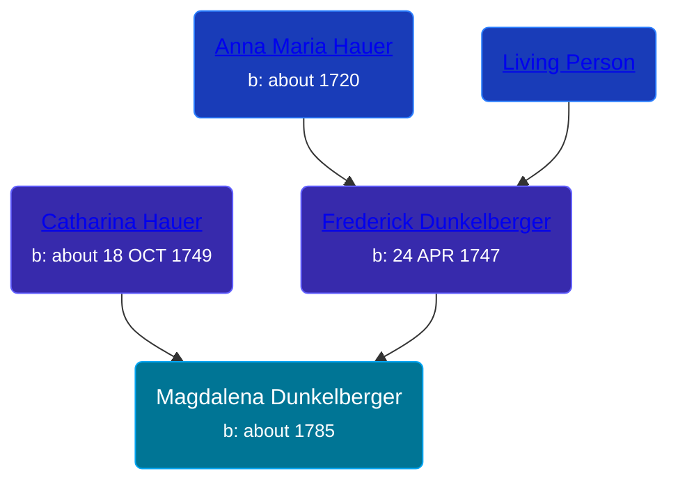

## 🟣 Magdalena Dunkelberger
<small>Age: 25y</small>

Daughter of [Frederick Dunkelberger](/people/2/29307544) and [Catharina Hauer](/people/7/70737648)





### 📆 Events


Type | Date | Age at Event | Place
------ | ------ | ------ | ------
[Birth](#event-event-3) | about 1785 |  | Northumberland, Pennsylvania, USA
[Death](#event-event-4) | about 1810 | 25y |



- **[Birth](#event-event-3)**
**Date**: about 1785, Age:
**Place**: Northumberland, Pennsylvania, USA
- **[Death](#event-event-4)**
**Date**: about 1810, Age: 25y
**Place**:


## 👩‍❤️‍👨 Relationships

### 🔵 [Phillip Henninger](/people/6/69475448), b. 1780

#### Children With Phillip Henninger
* 🟣 [Magdalena Sophia Henninger](/people/6/64241610), b. 07 JAN 1811
### 📰 Event Sources

####  Birth, about 1785
* Ron Wilson's Research

####  Death, about 1810
* Ron Wilson's Research