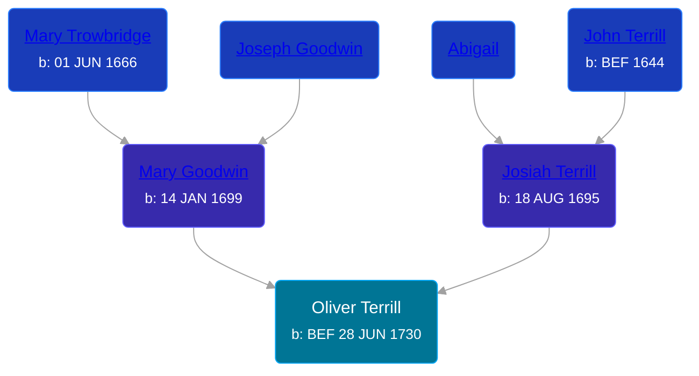

## 🔵 Oliver Terrill
<small>Age: 85y, 5m, 2d</small>

Son of [Josiah Terrill](/people/8/80183041) and [Mary Goodwin](/people/4/49404198)





### 📆 Events


Type | Date | Age at Event | Place
------ | ------ | ------ | ------
[Birth](#event-event-2) | BEF 28 JUN 1730 |  | Milford, Connecticut, USA
[Baptism](#event-event-0) | 28 JUN 1730 |  |
[Death](#event-event-4) | 1816 | 85y, 5m, 2d | Columbia, Lorain, Ohio, USA
[Burial](#event-event-5) |  |  | Beebetown Church Cemetery, Beebetown, Medina, Ohio, USA



- **[Birth](#event-event-2)**
**Date**: BEF 28 JUN 1730, Age:
**Place**: Milford, Connecticut, USA
- **[Baptism](#event-event-0)**
**Date**: 28 JUN 1730, Age:
**Place**:
- **[Death](#event-event-4)**
**Date**: 1816, Age: 85y, 5m, 2d
**Place**: Columbia, Lorain, Ohio, USA
- **[Burial](#event-event-5)**
**Date**:
**Place**: Beebetown Church Cemetery, Beebetown, Medina, Ohio, USA


## 👩‍❤️‍👨 Relationships

### 🟣 [Lydia ](/people/1/18213296)

#### Events


Type | Date | Age at Event | Place
------ | ------ | ------ | ------
[Marriage](#event-family-0-event-0) | 02 DEC 1760 | 30y, 5m, 4d |



- **[Marriage](#event-family-0-event-0)**
**Date**: 02 DEC 1760, Age: 30y, 5m, 4d
**Place**:


#### Children With Lydia
* 🟣 [Lucinda Terrill](/people/7/77474035), b. 08 FEB 1762
* 🔵 [Ichabod Terrell](/people/6/66420816), b. 20 DEC 1763
## 📝 Notes
>   
  > Oliver Terrill part of the 7th Connecticut Regiment in the Revolutionary War. He enlisted 26 May 1777 and was discharged 9 Jan 1778.
### 📰 Event Sources

####  Birth, BEF 28 JUN 1730
* Roger and Abigail (Ufford) Terrill and Some Descendants: 1632 - 1993  - 22
* The Town and City of Waterbury, Connecticut  - 135

####  Baptism, 28 JUN 1730
* Connecticut, Church Record Abstracts, 1630-1920
>   
  > Oliver, s. Mary, w. of Josiah, bp. Jun 28, 1730  
  > Vol 1, Page 55
* Roger and Abigail (Ufford) Terrill and Some Descendants: 1632 - 1993  - 22

####  Death, 1816
* Roger and Abigail (Ufford) Terrill and Some Descendants: 1632 - 1993  - 36
* The Town and City of Waterbury, Connecticut  - 136

####  Burial
* Roger and Abigail (Ufford) Terrill and Some Descendants: 1632 - 1993  - 36
####  Marriage, 02 DEC 1760
* The Town and City of Waterbury, Connecticut  - 136
* Connecticut Town Birth Records, pre-1870 (Barbour Collection)  - 356
>   
  > Oliver, s. Josiah, of Waterbury, m. Lidda Lewis, wid. of Eli, of Lime, Dec. 2, 1760. Vol 1, Page 475
