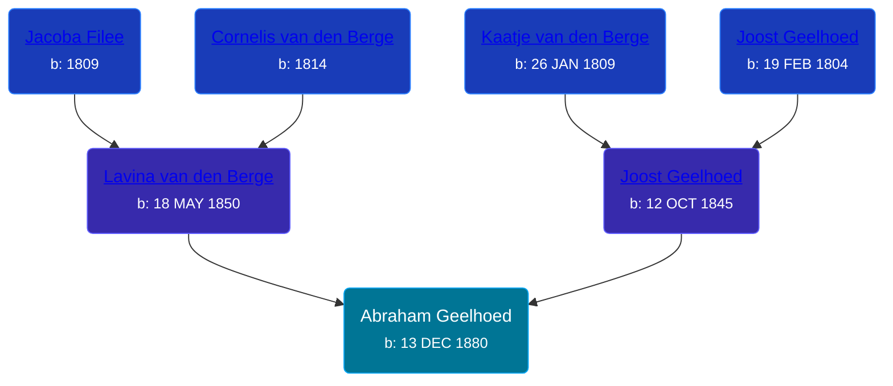

## 🔵 Abraham Geelhoed
<small>Age: 11m, 17d</small>

Son of [Joost Geelhoed](/people/7/73673934) and [Lavina van den Berge](/people/7/71558365)





### 📆 Events


Type | Date | Age at Event | Place
------ | ------ | ------ | ------
[Birth](#event-event-2) | 13 DEC 1880 |  | Dreischor, Zeeland, Netherlands
[Death](#event-event-3) | Bef Dec 1881 | 11m, 17d |



- **[Birth](#event-event-2)**
**Date**: 13 DEC 1880, Age:
**Place**: Dreischor, Zeeland, Netherlands
- **[Death](#event-event-3)**
**Date**: Bef Dec 1881, Age: 11m, 17d
**Place**:


### 📰 Event Sources

####  Birth, 13 DEC 1880
* Geelhoet, Geelhoed & Geelhoedt Genealogie  - 142

####  Death, Bef Dec 1881
* Geelhoet, Geelhoed & Geelhoedt Genealogie  - 142