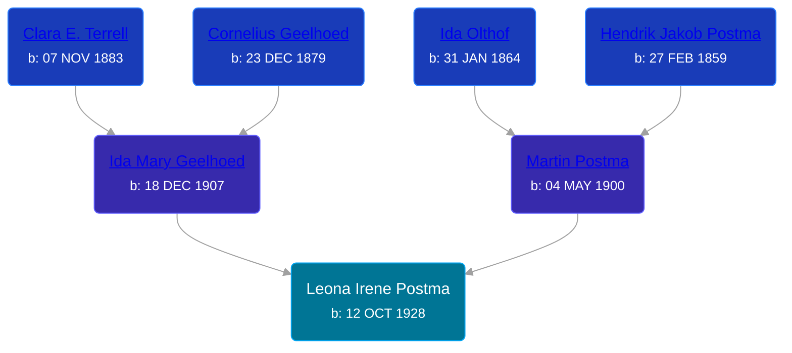

## 🟣 Leona Irene Postma
<small>Age: 36y, 12d</small>

Daughter of [Martin Postma](/people/7/7474832) and [Ida Mary Geelhoed](/people/1/11612484)





### 📆 Events


Type | Date | Age at Event | Place
------ | ------ | ------ | ------
Birth | 12 OCT 1928 |  | Michigan, USA
[Residence](#event-event-0) | 21 APR 1930 | 1y, 6m, 9d | Paris Township, Kent, Michigan, USA
[Residence](#event-event-1) | 17 APR 1950 | 21y, 6m, 5d |
[Death](#event-event-5) | 24 OCT 1964 | 36y, 12d | Cutlerville, Kent, Michigan, USA
Burial |  |  | Chapel Hill Memorial Gardens, Grand Rapids, Kent, Michigan, United States



- **Birth**
**Date**: 12 OCT 1928, Age:
**Place**: Michigan, USA
- **[Residence](#event-event-0)**
**Date**: 21 APR 1930, Age: 1y, 6m, 9d
**Place**: Paris Township, Kent, Michigan, USA
- **[Residence](#event-event-1)**
**Date**: 17 APR 1950, Age: 21y, 6m, 5d
**Place**:
- **[Death](#event-event-5)**
**Date**: 24 OCT 1964, Age: 36y, 12d
**Place**: Cutlerville, Kent, Michigan, USA
- **Burial**
**Date**:
**Place**: Chapel Hill Memorial Gardens, Grand Rapids, Kent, Michigan, United States


## 👩‍❤️‍👨 Relationships

### 🔵 [Norman Eugene Hall](/people/1/13152600), b. 18 JUN 1925

#### Events


Type | Date | Age at Event | Place
------ | ------ | ------ | ------
[Marriage](#event-family-0-event-0) | 28 JUL 1950 | 21y, 9m, 16d | Byron Center, Kent, Michigan, USA



- **[Marriage](#event-family-0-event-0)**
**Date**: 28 JUL 1950, Age: 21y, 9m, 16d
**Place**: Byron Center, Kent, Michigan, USA


#### Children With Norman Eugene Hall
* 🔵 [Living Person](/people/4/43722245)
* 🟣 [Living Person](/people/2/22163356)
* 🟣 [Living Person](/people/7/79976512)
* 🔵 [Living Person](/people/6/64346114)
* 🔵 [Living Person](/people/1/11849400)
* 🟣 [Living Person](/people/4/48284515)
* 🟣 [Living Person](/people/5/59893848)
* 🟣 [Living Person](/people/2/22592836)
* 🔵 [Douglas Eugene Hall](/people/7/70699507), b. 08 JUN 1956
### 📰 Event Sources

####  Residence, 21 APR 1930
* 1930 US Census
>   
  > Name: Leona I Postma  
  > Birth Year: abt 1929  
  > Gender: Female  
  > Race: White  
  > Age in 1930: 1  
  > Birthplace: Michigan  
  > Marital Status: Single  
  > Relation to Head of House: Daughter  
  > Home in 1930: Paris, Kent, Michigan, USA  
  > Street Address: Janet Street  
  > House Number: 352  
  > Dwelling Number: 443  
  > Family Number: 443  
  > Attended School: No  
  > Father's Birthplace: Michigan  
  > Mother's Birthplace: Michigan  
  >   
  > Household members:  
  > Martin Postma, 29, Head  
  > Ida M Postma, 22, Wife  
  > Ida C Postma, 3, Daughter  
  > Leona I Postma, 1, Daughter  
  > Henry C Postma, 0, Son  
  >

####  Residence, 17 APR 1950
* 1950 US Census
>   
  > Name: Leona Postma  
  > Age: 21  
  > Birth Date: abt 1929  
  > Gender: Female  
  > Race: White  
  > Birth Place: Michigan  
  > Marital Status: Never Married (Single)  
  > Relation to Head of House: Daughter  
  > Residence Date: 1950  
  > Home in 1950: Gaines, Kent, Michigan, USA  
  > Street Name: 60th Street  
  > Apartment Number: 2864  
  > Dwelling Number: 271  
  > Farm: Yes  
  > Occupation: Presser  
  > Industry: Dry Cleaner  
  > Occupation Category: Wk  
  > Hours Worked: 48  
  > Worker Class: Private  
  >   
  > Household members:  
  > Martin Postma, 49, Head  
  > Ida Postma, 42, Wife  
  > Leona Postma, 21, Daughter  
  > Martin Postma Jr, 18, Son  
  > Kenneth Postma, 14, Son  
  > David Postma, 10, Son  
  > Joseph Postma, 7, Son  
  > Martha Postma, 6, Daughter  
  > Henry Postma, 90, Father  
  >   
  >

####  Marriage, 28 JUL 1950
* Michigan, Marriage Records, 1867-1952
>   
  > Name: Leona I Postma  
  > Gender: Female  
  > Race: White  
  > Birth Year: abt 1929  
  > Birth Place: Grand Rapids, Michigan  
  > Marriage Date: 28 Jul 1950  
  > Marriage Place: Byron Center, Kent, Michigan, USA  
  > License County: Kent  
  > Age: 21  
  > Residence Place: Grand Rapids, Michigan  
  > Father: Martin Postma  
  > Mother: Ida Geelhoed  
  > Spouse: Norman E Hall  
  > Spouse Gender: Male  
  > Spouse Race: White  
  > Spouse Age: 25  
  > Spouse Birth Place: Charlevoiz County, Michigan  
  > Spouse Residence Place: Grand Rapids, Michigan  
  > Spouse Father: Russell Hall  
  > Spouse Mother: Elva Irene Hillicker  
  > County File Number: 105-150  
  > State File Number: 41 51750  
  > Film: 124  
  > Film Title: 41 Kent 48600-51899  
  > Film Description: Kent (1949 - 1950)

####  Death, 24 OCT 1964
* Kent County, Michigan Death Certificates  - 99290
* The Grand Rapids Press  - 10/26/1964
>   
  > HALL -- Mrs. Leona I. Hall, aged 36, of 8012 68th St. SE, Alto, recenty of 4260 Colby Ave. SW, Wyoming, passed away Saturday evening at Blodgett Hospital of accidental injuries. She is survived by her husband, Norman E. Hall; four sons, Allan, James, Douglas, Kevin; five daughters, Norma, Christina, Nancy, Patricia, and Cheryl; her parents, Mr. andMrs. Martin Postma; five brothers, Henry, Martin Jr., Kenneth and David Postma, all of Grand Rapids, and Joseph Postma of Boston, Mass.; two sisters, Mrs. Ida Bowyer, Mrs. Martha Wilson, both of Grand Rapids. Funeral services will be held Wednesday at 2:00 p.m. in the Good News Baptist Church, 68th and Eastern with REv. S. H. Houbolt officiating. Interment Chapel Hill Memorial Gardens.
