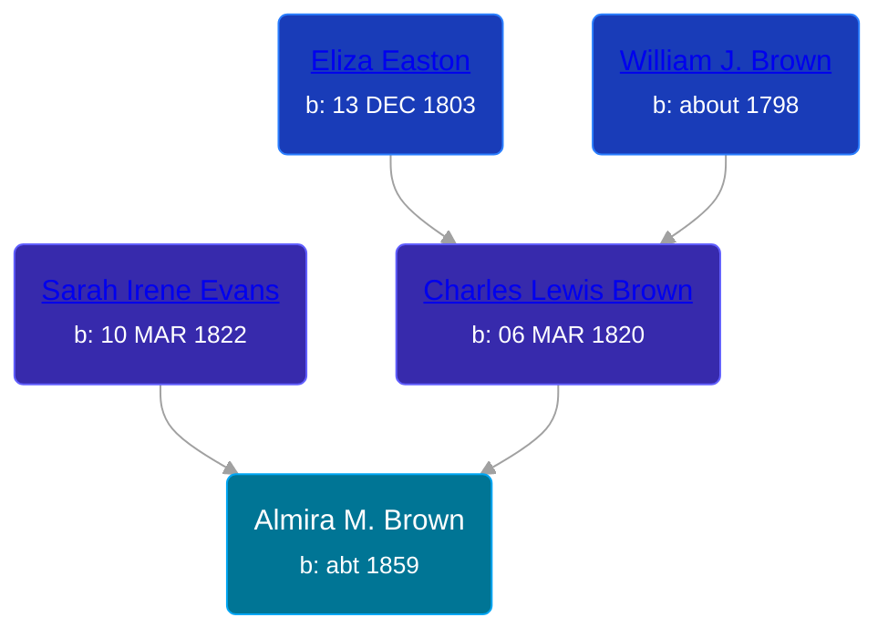

## 🟣 Almira M. Brown

Daughter of [Charles Lewis Brown](/people/7/70538697) and [Sarah Irene Evans](/people/4/47294572)





### 📆 Events


Type | Date | Age at Event | Place
------ | ------ | ------ | ------
Birth | abt 1859 |  |



- **Birth**
**Date**: abt 1859, Age:
**Place**:

