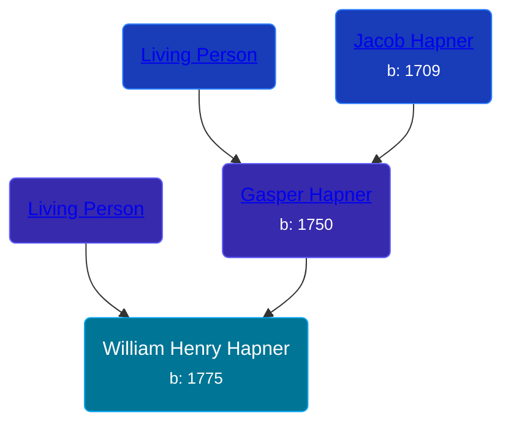

## 🔵 William Henry Hapner
<small>Age: 71y</small>

Son of [Gasper Hapner](/people/9/920624) and [Living Person](/people/7/78872424)





### 📆 Events


Type | Date | Age at Event | Place
------ | ------ | ------ | ------
Birth | 1775 |  | Rockingham, Virginia, USA
Death | 1846 | 71y | Preble, Ohio, USA
[Burial](#event-event-4) |  |  | Roselawn Cemetery, Lewisburg, Preble, Ohio, USA



- **Birth**
**Date**: 1775, Age:
**Place**: Rockingham, Virginia, USA
- **Death**
**Date**: 1846, Age: 71y
**Place**: Preble, Ohio, USA
- **[Burial](#event-event-4)**
**Date**:
**Place**: Roselawn Cemetery, Lewisburg, Preble, Ohio, USA


## 👩‍❤️‍👨 Relationships

### 🟣 [Jane Boyd](/people/5/54740480), b. Abt 1780

#### Events


Type | Date | Age at Event | Place
------ | ------ | ------ | ------
[Marriage](#event-family-0-event-0) | 19 JUN 1806 | 31y, 6m, 19d | Augusta, Virginia, USA



- **[Marriage](#event-family-0-event-0)**
**Date**: 19 JUN 1806, Age: 31y, 6m, 19d
**Place**: Augusta, Virginia, USA


#### Children With Jane Boyd
* 🔵 [Alexander Hapner](/people/6/68586072), b. 05 JAN 1809
* 🔵 [Harrison Hapner](/people/8/82056089), b. 1818
### 📰 Event Sources

####  Burial
* findagrave.com

####  Marriage, 19 JUN 1806
* Virginia, Compiled Marriages, 1740-1850
>   
  > Name: Jane Boyd  
  > Gender: Female  
  > Spouse Name: William Hapener  
  > Spouse Gender: Male  
  > Marriage Date: 19 Jun 1806  
  > County: Augusta  
  > State: Virginia
