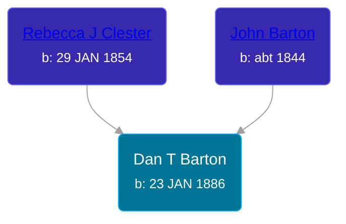

## 🔵 Dan T Barton
<small>Age: 82y, 6m, 15d</small>

Son of [John Barton](/people/5/56328061) and [Rebecca J Clester](/people/8/81769008)





### 📆 Events


Type | Date | Age at Event | Place
------ | ------ | ------ | ------
Birth | 23 JAN 1886 |  | Kansas, USA
[Residence](#event-event-0) | 19 JAN 1920 | 33y, 11m, 26d | Jackson, Montgomery, Iowa, USA
[Residence](#event-event-1) | 01 JAN 1925 | 38y, 11m, 8d | Villisca, Montgomery, Iowa, USA
[Residence](#event-event-2) | 23 APR 1930 | 44y, 3m | Tompkins Township, Jackson, Michigan, USA
[Residence](#event-event-3) | 1935 | 48y, 10m, 7d | Tompkins Township, Jackson, Michigan, USA
[Residence](#event-event-4) | 15 APR 1940 | 54y, 2m, 22d | Tompkins Township, Jackson, Michigan, USA
[Residence](#event-event-5) | 02 MAY 1950 | 64y, 3m, 9d | Michigan Center, Jackson, Michigan, USA
[Death](#event-event-9) | 08 AUG 1968 | 82y, 6m, 15d | Jackson, Jackson, Michigan, USA
Burial | 12 AUG 1968 | 82y, 6m, 19d | Hillcrest Cemetery, Jackson, Michigan, USA



- **Birth**
**Date**: 23 JAN 1886, Age:
**Place**: Kansas, USA
- **[Residence](#event-event-0)**
**Date**: 19 JAN 1920, Age: 33y, 11m, 26d
**Place**: Jackson, Montgomery, Iowa, USA
- **[Residence](#event-event-1)**
**Date**: 01 JAN 1925, Age: 38y, 11m, 8d
**Place**: Villisca, Montgomery, Iowa, USA
- **[Residence](#event-event-2)**
**Date**: 23 APR 1930, Age: 44y, 3m
**Place**: Tompkins Township, Jackson, Michigan, USA
- **[Residence](#event-event-3)**
**Date**: 1935, Age: 48y, 10m, 7d
**Place**: Tompkins Township, Jackson, Michigan, USA
- **[Residence](#event-event-4)**
**Date**: 15 APR 1940, Age: 54y, 2m, 22d
**Place**: Tompkins Township, Jackson, Michigan, USA
- **[Residence](#event-event-5)**
**Date**: 02 MAY 1950, Age: 64y, 3m, 9d
**Place**: Michigan Center, Jackson, Michigan, USA
- **[Death](#event-event-9)**
**Date**: 08 AUG 1968, Age: 82y, 6m, 15d
**Place**: Jackson, Jackson, Michigan, USA
- **Burial**
**Date**: 12 AUG 1968, Age: 82y, 6m, 19d
**Place**: Hillcrest Cemetery, Jackson, Michigan, USA


## 👩‍❤️‍👨 Relationships

### 🟣 [Blanche Ellen Powell](/people/8/88023024), b. 10 FEB 1896

#### Events


Type | Date | Age at Event | Place
------ | ------ | ------ | ------
[Marriage](#event-family-0-event-0) | 19 NOV 1917 | 31y, 9m, 26d | Clarinda, Iowa, USA



- **[Marriage](#event-family-0-event-0)**
**Date**: 19 NOV 1917, Age: 31y, 9m, 26d
**Place**: Clarinda, Iowa, USA


#### Children With Blanche Ellen Powell
* 🔵 [Harry William Barton](/people/8/83492690), b. 15 FEB 1919
* 🔵 [Elvin Carl Barton](/people/6/61879288), b. 21 MAR 1920
* 🟣 [Living Person](/people/2/28182172)
* 🟣 [Living Person](/people/5/51270496)
* 🔵 [Living Person](/people/7/77714466)
* 🔵 [Living Person](/people/5/57670820)
### 📰 Event Sources

####  Marriage, 19 NOV 1917
* Iowa, U.S., Marriage Records, 1880-1949
>   
  > Name: Dan Barton  
  > Gender: Male  
  > Race: White  
  > Age: 33  
  > Birth Date: abt 1884  
  > Birth Place: Jamestown-Kans  
  > Marriage Date: 19 Nov 1917  
  > Marriage Place: Clarinda, Page, Iowa, USA  
  > Father: J W Barton  
  > Spouse: Blanche Ellen Powell  
  > Spouse Gender: Female  
  > Spouse Race: White  
  > Spouse Age: 21  
  > Spouse Birth Date: abt 1896  
  > Spouse Birth Place: New Market Iowa  
  > Spouse Father: Elvin M Powell  
  > Spouse Mother: May E Burris  
  > Volume Number: 475 (Madison - Pocahontas)  
  >

####  Residence, 19 JAN 1920
* 1920 US Census
>   
  > 1920 US Census  
  > Jackson, Montgomery, Iowa, USA  
  > 19 Jan 1920  
  >   
  > Name: Daniel L Barton [Daniel F Barton]  
  > Age: 36  
  > Birth Year: abt 1884  
  > Birthplace: Kansas  
  > Home in 1920: Jackson, Montgomery, Iowa  
  > Street: West Third Street  
  > Residence Date: 1920  
  > Race: White  
  > Gender: Male  
  > Relation to Head of House: Head  
  > Marital Status: Married  
  > Spouse's Name: Blanche Barton  
  > Father's Birthplace: USA  
  > Mother's Birthplace: USA  
  > Native Tongue: English  
  > Able to Speak English: Yes  
  > Occupation: Operator  
  > Industry: Steam Shovel  
  > Employment Field: Wage or Salary  
  > Home Owned or Rented: Rented  
  > Able to read: Yes  
  > Able to Write: Yes  
  >   
  > Household members:  
  > Blanche Barton, 33, Wife  
  > Harry W Barton, 0, Son  
  > Lena Powell, 15, Sister-in-law  
  >

####  Residence, 01 JAN 1925
* 1925 Iowa State Census
>   
  > Name: Dan Barton  
  > Residence Age: 39  
  > Birth Year: abt 1886  
  > Birth Place: Kansas  
  > Residence Date: 1 Jan 1925  
  > Residence Place: Villisca, Montgomery, Iowa, USA  
  > Race: White  
  > Gender: Male  
  > Relation to Head: Head  
  > Marital Status: Married  
  > Spouse: Blanch Powell  
  > Father: John Barton  
  > Father Birth Place: Pennsylvania  
  > Mother: Mary Chester  
  > Mother Birth Place: Illinois  
  > Parents' Marriage Place: Illinois  
  >   
  > Household members:  
  > Dan Barton, 39, Head  
  > Blanch Powell, 27, Wife  
  > Harry Barton, 6, Son  
  > Alvin Barton, 4, Son  
  > Gene Barton, 2, Son  
  > Dorris Barton, 1, Daughter  
  >

####  Residence, 23 APR 1930
* 1930 US Census
>   
  > Name: Dan Barton  
  > Sex: Male  
  > Age: 45 years  
  > Birth Year (Estimated): 1885  
  > Birthplace: Kansas  
  > Marital Status: Married  
  > Race: White  
  > Relationship to Head of Household: Head  
  > Father's Birthplace: Pennsylvania  
  > Mother's Birthplace: Ireland  
  > Event Type: Census  
  > Event Date: 1930  
  > Event Place: Tompkins, Jackson, Michigan, United States  
  > Event Place (Original): Tompkins, Jackson, Michigan, United States  
  > Line Number: 23  
  > Sheet Letter: A  
  > Sheet Number: 9  
  >   
  > Dan Barton, Head, 45, Kansas  
  > Blanche E Barton, Wife F 34, Iowa  
  > Harry W Barton, Son, 11, Iowa  
  > Elvin C Barton, Son, 10, Iowa  
  > Jean L Barton, Daughter F 9, Iowa  
  > Doris, Barton, Daughter F 6, Iowa  
  > Junior D Barton, Son, 2, Michigan  
  >

####  Residence, 1935
* 1940 US Census

####  Residence, 15 APR 1940
* 1940 US Census
>   
  > Name: Dan Barton  
  > Age: 55  
  > Estimated Birth Year: abt 1885  
  > Gender: Male  
  > Race: White  
  > Birthplace: Kansas  
  > Marital Status: Married  
  > Relation to Head of House: Head  
  > Home in 1940: Tompkins, Jackson, Michigan  
  > Map of Home in 1940: Tompkins, Jackson, Michigan  
  > Farm: Yes  
  > Inferred Residence in 1935: Tompkins, Jackson, Michigan  
  > Residence in 1935: Tompkins, Jackson, Michigan  
  > Resident on farm in 1935: Yes  
  > Sheet Number: 7B  
  > Number of Household in Order of Visitation: 156  
  > Occupation: Farmer  
  > House Owned or Rented: Rented  
  > Value of Home: 10  
  > Attended School or College: No  
  > Highest Grade Completed: Elementary school, 8th grade  
  > Class of Worker: Working on own account  
  > Weeks Worked in 1939: 52  
  > Income: 0  
  > Income Other Sources: No  
  >   
  > Household members  
  > Dan Barton, 55  
  > Blanche Barton, 44  
  > Harry Barton, 29  
  > Alvin Barton, 20  
  > Doris Barton, 16  
  > Dan Barton, 12  
  > Anna Barton, 8  
  >

####  Residence, 02 MAY 1950
* 1950 US Census
>   
  > 1950 US Census  
  > Michigan Center, Jackson, Michigan, USA  
  > 2 May 1950  
  >   
  > Name: Dan Barton  
  > Age: 64  
  > Birth Date: abt 1886  
  > Gender: Male  
  > Race: White  
  > Birth Place: Kansas  
  > Marital Status: Widowed  
  > Relation to Head of House: Head  
  > Residence Date: 1950  
  > Home in 1950: Michigan Center, Jackson, Michigan, USA  
  > Street Name: Stilwell  
  > House Number: 446  
  > Dwelling Number: 132  
  > Farm: No  
  > Acres: No  
  > Inferred Previous Residence Place:   
  > Occupation: Fireman  
  > Industry: Automobile Parts  
  > Father Birth Place: USA  
  > Mother Birth Place: USA  
  > Occupation Category: Working  
  > Hours Worked: 42  
  > Worker Class: Own Business  
  > Same House: Yes  
  > School Completed: S8  
  > Grade Completed: Yes  
  > School Attendance: 30 or over  
  > Weeks Worked: 40  
  > Income: 4100  
  > Other Income: none  
  > Supplemental Income: none  
  > Relative Income: 600  
  > World War II Veteran: No  
  > World War I Veteran: No  
  > Veteran: No  
  >   
  > Household members:  
  > Dan Barton, 64, Head  
  > Blanch E Barton, 54, Wife  
  > George M Barton, 18, Son  
  >

####  Death, 08 AUG 1968
* Michigan Death Certificates
>   
  > Name: Dan Barton  
  > Date of Birth: 1/23/1886  
  > State of Birth: Kansas  
  > Age: 82  
  > Sex: Male  
  > Race: White  
  > Date of Death: 8/8/1968  
  > Death Place: Jackson, Jackson, MI  
  > Citizen of: USA  
  > Maritial Status: Widowed  
  > Surviving Spouse: None  
  > Occupation: Maintenance  
  > Kind of Business or Industry: Hancocks  
  > Residence: Leoni Twp, Jackson, MI  
  > Father: John Barton  
  > Mother: Rebecca Clester  
  > Informant: Jean Tingley  
  > Burial: Hillcrest, Jackson, MI  
  > Date: 8/12/1968  
  > Local File Number: J 610
* U.S., Social Security Death Index, 1935-2014
>   
  > Name: DAN BARTON  
  > Birth: 22 Jan 1886  
  > Death: Aug 1968  
  > Last Residence: 49254 (Michigan Center, Jackson, MI)  
  > Last Benefit: (none specified)  
  > SSN: ###-##-####  
  > Issued: Michigan
