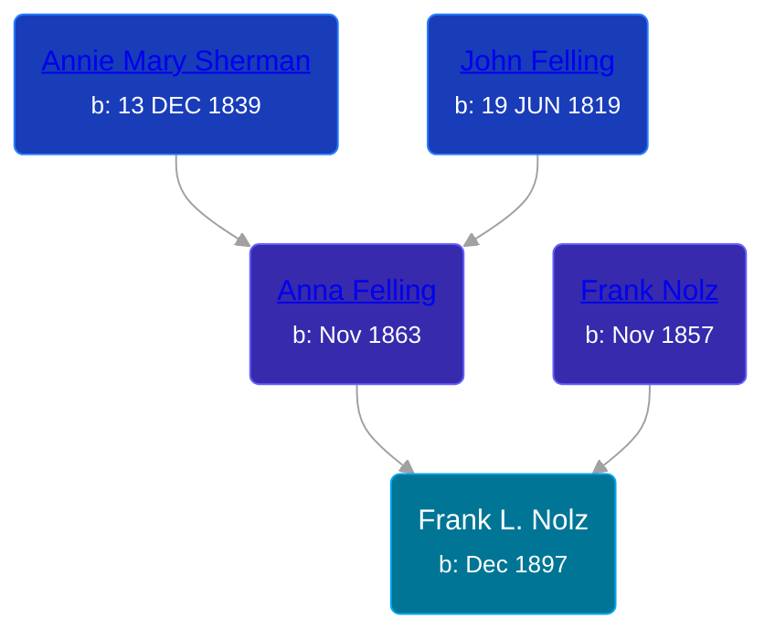

## 🔵 Frank L. Nolz

Son of [Frank Nolz](/people/6/61628928) and [Anna Felling](/people/1/1735561)





### 📆 Events


Type | Date | Age at Event | Place
------ | ------ | ------ | ------
Birth | Dec 1897 |  | Minnesota, USA
[Residence](#event-event-0) | 06 JUN 1900 | 2y, 6m, 6d | St Paul, Ramsey, Minnesota, USA
[Residence](#event-event-1) | 02 MAY 1910 | 12y, 5m, 2d | St Paul, Ramsey, Minnesota, USA
[Residence](#event-event-2) | 13 JAN 1920 | 22y, 1m, 13d | St Paul, Ramsey, Minnesota, USA



- **Birth**
**Date**: Dec 1897, Age:
**Place**: Minnesota, USA
- **[Residence](#event-event-0)**
**Date**: 06 JUN 1900, Age: 2y, 6m, 6d
**Place**: St Paul, Ramsey, Minnesota, USA
- **[Residence](#event-event-1)**
**Date**: 02 MAY 1910, Age: 12y, 5m, 2d
**Place**: St Paul, Ramsey, Minnesota, USA
- **[Residence](#event-event-2)**
**Date**: 13 JAN 1920, Age: 22y, 1m, 13d
**Place**: St Paul, Ramsey, Minnesota, USA


### 📰 Event Sources

####  Residence, 06 JUN 1900
* 1900 US Census

####  Residence, 02 MAY 1910
* 1910 US Census

####  Residence, 13 JAN 1920
* 1920 US Census
