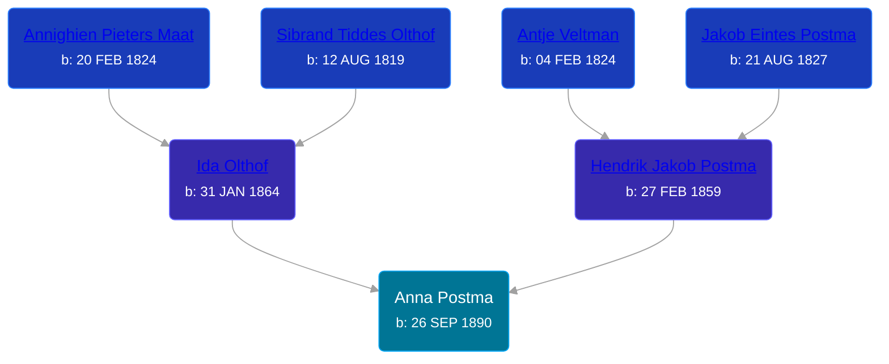

## 🟣 Anna Postma
<small>Age: 25y, 7m, 6d</small>

Daughter of [Hendrik Jakob Postma](/people/3/31727152) and [Ida Olthof](/people/6/60020862)





### 📆 Events


Type | Date | Age at Event | Place
------ | ------ | ------ | ------
[Birth](#event-event-2) | 26 SEP 1890 |  | Michigan, United States
[Residence](#event-event-0) | 1894 | 3y, 2m, 4d | Gaines Township, Kent, Michigan, USA
[Residence](#event-event-1) | 29 JUN 1900 | 9y, 9m, 3d | Gaines Township, Kent, Michigan, USA
[Residence](#event-event-2) | 1910 | 19y, 2m, 4d | Gaines Township, Kent, Michigan, USA
[Death](#event-event-6) | 02 MAY 1916 | 25y, 7m, 6d | Gaines Township, Kent, Michigan, USA
[Burial](#event-event-7) | 07 MAY 1916 | 25y, 7m, 11d | Pine Hill Cemetery, Kentwood, Kent, Michigan, USA



- **[Birth](#event-event-2)**
**Date**: 26 SEP 1890, Age:
**Place**: Michigan, United States
- **[Residence](#event-event-0)**
**Date**: 1894, Age: 3y, 2m, 4d
**Place**: Gaines Township, Kent, Michigan, USA
- **[Residence](#event-event-1)**
**Date**: 29 JUN 1900, Age: 9y, 9m, 3d
**Place**: Gaines Township, Kent, Michigan, USA
- **[Residence](#event-event-2)**
**Date**: 1910, Age: 19y, 2m, 4d
**Place**: Gaines Township, Kent, Michigan, USA
- **[Death](#event-event-6)**
**Date**: 02 MAY 1916, Age: 25y, 7m, 6d
**Place**: Gaines Township, Kent, Michigan, USA
- **[Burial](#event-event-7)**
**Date**: 07 MAY 1916, Age: 25y, 7m, 11d
**Place**: Pine Hill Cemetery, Kentwood, Kent, Michigan, USA


### 📰 Event Sources

####  Birth, 26 SEP 1890
* Michigan, U.S., Birth Records, 1867-1914
>   
  > Name: Anna Postema  
  > Gender: Female  
  > Race: White  
  > Birth Date: 26 Sep 1890  
  > Birth Place: Michigan, USA  
  > Father: Henry Postema  
  > Mother: Ida Postema  
  > Jurisdiction Number: 4421  
  > Reference Number: 79  
  >

####  Residence, 1894
* 1894 Michigan State Census
>   
  > Name: Anna Postma  
  > Sex: Female  
  > Age: 3  
  > Residence Place: Gaines, Kent, Michigan, United States  
  > Relationship to Head of Household: Daughter  
  > Event Type: Census  
  > Event Place: Gaines, Kent, Michigan, United States  
  > Event Place (Original): Gaines, Kent, Michigan, United States  
  > Line Number: 13  
  > Page Number: 1  
  > Microfilm Number: 984658  
  > Indexing Batch: N04014-8

####  Residence, 29 JUN 1900
* 1900 US Census
>   
  > Name: Anna Postma  
  > Sex: Female  
  > Age: 9  
  > Birth Date: September 1891  
  > Birthplace: Michigan  
  > Marital Status: Single  
  > Race: White  
  > Relationship to Head of Household: Daughter  
  > Father's Birthplace: Holland  
  > Mother's Birthplace: Holland  
  > Event Type: Census  
  > Event Date: 1900  
  > Event Place: Gaines Township, Kent, Michigan, United States  
  > Line Number: 15  
  > Sheet Letter: A  
  > Sheet Number: 13

####  Residence, 1910
* 1910 US Census

####  Death, 02 MAY 1916
* Michigan, Death Records, 1867-1950
>   
  > Name: Anna Postma  
  > Gender: Female  
  > Marital Status: Single  
  > Birth Date: Sep, 1890  
  > Birth Place: Michigan  
  > Death Date: 2 May 1916  
  > Death Place: Gaines, Kent, Michigan, USA  
  > Death Age: 25  
  > File Number: 139  
  > Father: Hendrick Postma  
  > Mother: Ida Olthof
* Michigan Death Certificates
>   
  > State of Michigan  
  >   
  > Department of State -- Division of Vital Statistics  
  >   
  > Transcript of Certificate of Death  
  >   
  > Registered No. 10  
  >   
  >   
  > Place of Death  
  >   
  > County: Kent  
  >   
  > Township/Village/City: Gaines  
  >   
  > Full Name: Anna Postma  
  >   
  >   
  > Personal and Statistical Particulars  
  >   
  > Sex: Female  
  > Color/Race: White  
  > Date of Birth: Sep 26, 1890  
  > Aged: 25 yrs 7 mos 5 days  
  > Single/Married/Widowed/Divorsed: Single  
  > Birthplace: Michigan  
  > Name of Father: Hendrik Postma  
  > Birtplace of Father: Netherlands  
  > Maiden Name of Mother: Ida Olthof  
  > Birthplace of Mother: Netherlands  
  > Occupation: Domestic  
  >   
  >   
  > Medical Certificate of Death  
  >   
  > Date of Death: May 2, 1916  
  >   
  > Cause of Death: I hereby certify, that I attended deceased from Aug. 5, 1915, to May 3, 1916, that I last saw her alive on May. 1, 1916, and that death occurred on the date stated above at 2:30 pm. The cause of death was as follows: ???  
  >   
  > Place of Burial or Removal: Pine Hill  
  > Date of Burial: May 5, 1916  
  >   
  > Filed: May 4, 1916
* The Grand Rapids Herald  - 4 May 1916
>   
  > ANNA POSTMA  
  > Anna Postma, 25 years old, died Thursday at the home of her parents, Mr. and Mrs. Henry Postma, in Gaines township. Funeral services will beheld at the residence Friday, at 13 o'clock and at the Kellogsville Christian Reformed church at 2 o'clock. Interment in Pine Hill Cemetery.

####  Burial, 07 MAY 1916
* Pine Hill Cemetery, Personal Visit
>   
  > Postma, Anna  
  > Daughter of Henry & Ida Postma  
  > b: 1890; d: 1916