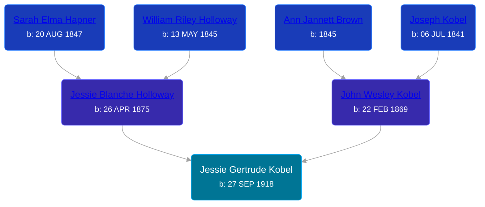

## 🟣 Jessie Gertrude Kobel
<small>Age: 88y, 11m, 20d</small>

Daughter of [John Wesley Kobel](/people/2/24649136) and [Jessie Blanche Holloway](/people/2/29242864)





### 📆 Events


Type | Date | Age at Event | Place
------ | ------ | ------ | ------
[Birth](#event-event-2) | 27 SEP 1918 |  | Elmira Township, Antrim, Michigan, USA
[Residence](#event-event-0) | 05 JAN 1920 | 1y, 3m, 8d | Warner Township, Antrim, Michigan, USA
[Residence](#event-event-1) | 29 APR 1930 | 11y, 7m, 2d | Warner Township, Antrim, Michigan, USA
[Death](#event-event-5) | 17 SEP 2007 | 88y, 11m, 20d | Big Rapids, Mecosta, Michigan, USA
[Burial](#event-event-6) |  |  | Chippewa Lake Cemetery, Chippewa Lake, Mecosta, Michigan, USA



- **[Birth](#event-event-2)**
**Date**: 27 SEP 1918, Age:
**Place**: Elmira Township, Antrim, Michigan, USA
- **[Residence](#event-event-0)**
**Date**: 05 JAN 1920, Age: 1y, 3m, 8d
**Place**: Warner Township, Antrim, Michigan, USA
- **[Residence](#event-event-1)**
**Date**: 29 APR 1930, Age: 11y, 7m, 2d
**Place**: Warner Township, Antrim, Michigan, USA
- **[Death](#event-event-5)**
**Date**: 17 SEP 2007, Age: 88y, 11m, 20d
**Place**: Big Rapids, Mecosta, Michigan, USA
- **[Burial](#event-event-6)**
**Date**:
**Place**: Chippewa Lake Cemetery, Chippewa Lake, Mecosta, Michigan, USA


## 👩‍❤️‍👨 Relationships

### 🔵 [Living Person](/people/9/96182747)

### 🔵 [Clare R. Gould](/people/5/58654048), b. 1913

#### Events


Type | Date | Age at Event | Place
------ | ------ | ------ | ------
[Marriage](#event-family-1-event-0) | 30 OCT 1936 | 18y, 1m, 3d |



- **[Marriage](#event-family-1-event-0)**
**Date**: 30 OCT 1936, Age: 18y, 1m, 3d
**Place**:


#### Children With Clare R. Gould
* 🟣 [Living Person](/people/3/33132669)
* 🔵 [Living Person](/people/5/53259826)
* 🟣 [Nancy Gould](/people/9/97367694)
* 🟣 [Living Person](/people/8/89432224)
* 🔵 [Living Person](/people/7/70072800)
### 📰 Event Sources

####  Birth, 27 SEP 1918
* U.S., Social Security Applications and Claims Index, 1936-2007

####  Residence, 05 JAN 1920
* 1920 US Census

####  Residence, 29 APR 1930
* 1930 US Census

####  Death, 17 SEP 2007
* Daggett Gilbert Funeral Home
>   
  > Jessie Gould Freelan, age 88 of Chippewa Lake, went to be with her Lord, Monday, September 17, 2007 at Mecosta County Medical Facility. She was born on the family farm in Elmira, on September 27, 1918, the 11th child of John and Jessie (Holloway) Kobel. Jessie married Clare Gould on October 30, 1936. They made their home in Grand Rapids and later in Holt, where Jessie was the secretary to Governor Soapy Williams. In 1955 Jessie retired from the Governor's office and the family moved to Chippewa Lake where they owned and operated the Chippewa Lake Bar for more than 27 years. Jessie returned to work for the State of Michigan during that time, and managed the Big Rapids Secretary of State office until her retirement. Her husband Clare passed away in 1984. Jessie continued to be an active member of the Chippewa Lake community; preparing tax returns, was a member of the Chippewa Lake Lions Club, the Chippewa Lake Community Church and volunteered for the Mecosta County Commission on Aging. In 1994 Jessie married Charlie Freelan who preceded her in death. Jessie is survived by her loving family; Four children; Darle (Kay) Gould of Big Rapids Charlene (Gene) Speet of Neely, MS Terry (Etta) Gould of Cincinnati, OH Patricia (David) Kuhn of Morley 14 grandchildren, 23 great-grandchildren step-son; Stanley (Connie) Freelan of Chippewa Lake sister-in-law; Margaret Butler of Ensley Center and many nieces and nephews. Besides her parents and husbands, Jessie was preceded in death by her daughter, Nancy Quinlan, 4 brothers; Harry, Joseph and Fred Kobel and infant brother, 6 sisters; Bessie Metzger, Vedah Kobel, Sarah Workman, Mabel Lowing, Gertrude Kobel and Elvira Kolk. Funeral services will take place 1:00 p.m. Friday, September 21st at the Chippewa Lake Community Church with Pastor Stephen Scott officiating. Burial will be at the Chippewa Lake Cemetery.
* U.S., Social Security Applications and Claims Index, 1936-2007
>   
  > Name:Jessie Gertrude Gould  
  > [Jessie G Freelan]   
  > [Jessie Gertrude Kobel]   
  > Gender:Female  
  > Race:White  
  > Birth Date:27 Sep 1918  
  > Birth Place:Elmira, Michigan  
  > Death Date:17 Sep 2007  
  > Father:John W Kobel  
  > Mother:Jessie B Holloway  
  > SSN:385099007  
  > Notes:Jan 1937: Name listed as JESSIE GERTRUDE GOULD; 19 Oct 1994: Name listed as JESSIE G FREELAN

####  Burial
* findagrave.com
####  Marriage, 30 OCT 1936
* Daggett Gilbert Funeral Home
