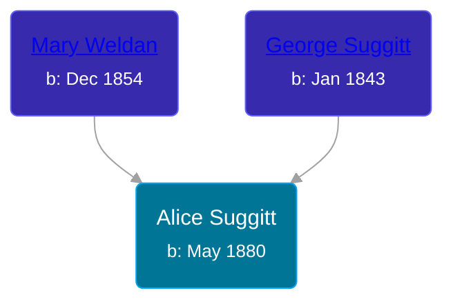

## 🟣 Alice Suggitt

Daughter of [George Suggitt](/people/4/48171276) and [Mary Weldan](/people/1/18538354)





### 📆 Events


Type | Date | Age at Event | Place
------ | ------ | ------ | ------
[Birth](#event-event-2) | May 1880 |  | Wortley, Yorkshire, England
[Residence](#event-event-0) | 1881 | 7m | Wortley, Bramley, Yorkshire, England
[Residence](#event-event-1) | 08 JUN 1900 | 20y, 1m, 8d | Neponset, Bureau, Illinois, USA



- **[Birth](#event-event-2)**
**Date**: May 1880, Age:
**Place**: Wortley, Yorkshire, England
- **[Residence](#event-event-0)**
**Date**: 1881, Age: 7m
**Place**: Wortley, Bramley, Yorkshire, England
- **[Residence](#event-event-1)**
**Date**: 08 JUN 1900, Age: 20y, 1m, 8d
**Place**: Neponset, Bureau, Illinois, USA


### 📰 Event Sources

####  Birth, May 1880
* 1900 US Census
* 1881 England Census

####  Residence, 1881
* 1881 England Census

####  Residence, 08 JUN 1900
* 1900 US Census