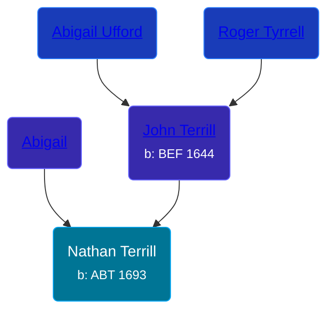

## 🔵 Nathan Terrill
<small>Age: 53y</small>

Son of [John Terrill](/people/6/65221157) and [Abigail ](/people/4/48582652)





### 📆 Events


Type | Date | Age at Event | Place
------ | ------ | ------ | ------
[Birth](#event-event-2) | ABT 1693 |  | Milford, Connecticut, USA
[Death](#event-event-3) | ABT 1746 | 53y | North Stratford, Connecticut, USA



- **[Birth](#event-event-2)**
**Date**: ABT 1693, Age:
**Place**: Milford, Connecticut, USA
- **[Death](#event-event-3)**
**Date**: ABT 1746, Age: 53y
**Place**: North Stratford, Connecticut, USA


### 📰 Event Sources

####  Birth, ABT 1693
* Roger and Abigail (Ufford) Terrill and Some Descendants: 1632 - 1993  - 10

####  Death, ABT 1746
* Roger and Abigail (Ufford) Terrill and Some Descendants: 1632 - 1993  - 20