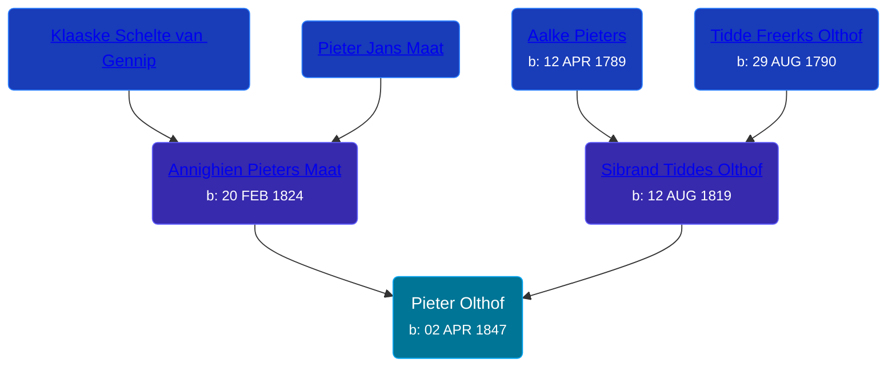

## 🔵 Pieter Olthof

Son of [Sibrand Tiddes Olthof](/people/7/76433820) and [Annighien Pieters Maat](/people/7/7249878)





### 📆 Events


Type | Date | Age at Event | Place
------ | ------ | ------ | ------
[Birth](#event-event-2) | 02 APR 1847 |  | Hellum, Slochteren, Netherlands



- **[Birth](#event-event-2)**
**Date**: 02 APR 1847, Age:
**Place**: Hellum, Slochteren, Netherlands


### 📰 Event Sources

####  Birth, 02 APR 1847
* Dutch Civil Register
>   
  > Child: Pieter Olthof  
  > Gender: Male  
  > Place of birth: Hellum gem. Slochteren  
  > Date of birth: Friday, April 02, 1847  
  > Father: Sibrand Tiddes Olthof  
  > Age: 27  
  > Occupation: boerenknecht  
  > Mother: Annechien Pieters Maat  
  > Event: Geboorte  
  > Date: Friday, April 02, 1847  
  > Event place: Hellum gem. Slochteren