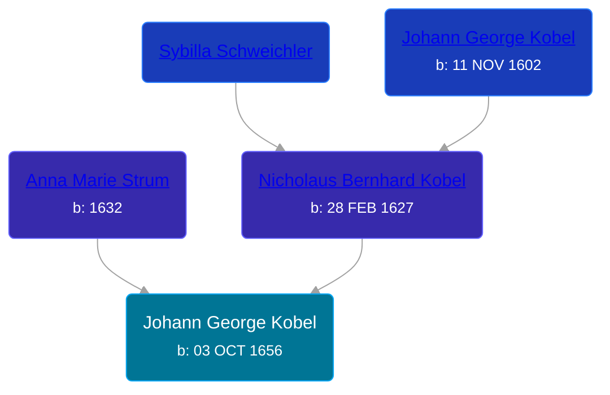

## 🔵 Johann George Kobel
<small>Age: 56y, 7m, 28d</small>

Son of [Nicholaus Bernhard Kobel](/people/5/51558544) and [Anna Marie Strum](/people/7/70388532)





### 📆 Events


Type | Date | Age at Event | Place
------ | ------ | ------ | ------
Birth | 03 OCT 1656 |  | Nordlengen, Donauworth, Germany
Death | 01 JUN 1713 | 56y, 7m, 28d | Hoffenheim Sinsheim, Baden, Germany



- **Birth**
**Date**: 03 OCT 1656, Age:
**Place**: Nordlengen, Donauworth, Germany
- **Death**
**Date**: 01 JUN 1713, Age: 56y, 7m, 28d
**Place**: Hoffenheim Sinsheim, Baden, Germany


## 👩‍❤️‍👨 Relationships

### 🟣 [Eva Sonsst](/people/4/40351050), b. abt 1657

#### Children With Eva Sonsst
* 🔵 [Johann Jacob Kobel](/people/8/81342340), b. 1682