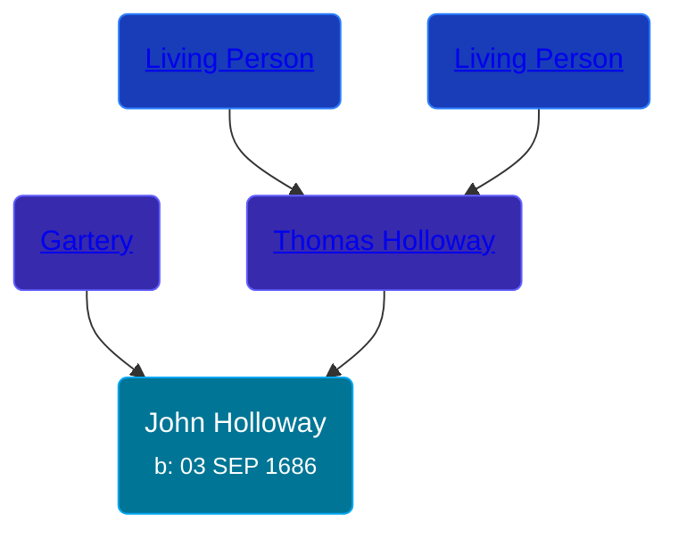

## 🔵 John Holloway

Son of [Thomas Holloway](/people/9/99720622) and [Gartery](/people/5/50554084)





### 📆 Events


Type | Date | Age at Event | Place
------ | ------ | ------ | ------
Birth | 03 SEP 1686 |  | Froom, Somersetshire, England



- **Birth**
**Date**: 03 SEP 1686, Age:
**Place**: Froom, Somersetshire, England


## 👩‍❤️‍👨 Relationships

### 🟣 [Mary Pharo](/people/5/54110711)

#### Children With Mary Pharo
* 🔵 [George Holloway](/people/3/36728768), b. 1709