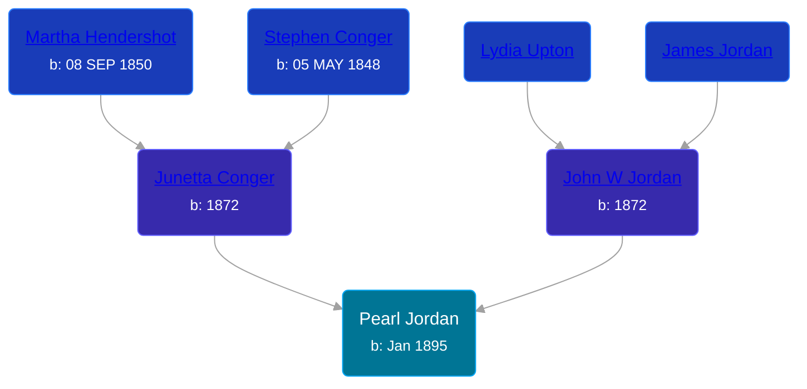

## 🟣 Pearl Jordan

Daughter of [John W Jordan](/people/9/97595723) and [Junetta Conger](/people/5/55321016)





### 📆 Events


Type | Date | Age at Event | Place
------ | ------ | ------ | ------
Birth | Jan 1895 |  | Kansas, USA
[Residence](#event-event-1) | 13 JUN 1900 | 5y, 5m, 13d | Powhattan, Brown, Kansas, USA
[Residence](#event-event-2) | 27 APR 1910 | 15y, 3m, 27d | Central, Knox, Nebraska, USA



- **Birth**
**Date**: Jan 1895, Age:
**Place**: Kansas, USA
- **[Residence](#event-event-1)**
**Date**: 13 JUN 1900, Age: 5y, 5m, 13d
**Place**: Powhattan, Brown, Kansas, USA
- **[Residence](#event-event-2)**
**Date**: 27 APR 1910, Age: 15y, 3m, 27d
**Place**: Central, Knox, Nebraska, USA


### 📰 Event Sources

####  Residence, 13 JUN 1900
* 1900 US Census
>
  > Name: Pearl Jordan
  > Age: 5
  > Birth Date: Jan 1895
  > Birthplace: Kansas, USA
  > Home in 1900: Powhattan, Brown, Kansas
  > Street: Main Street
  > Sheet Number: 11
  > Number of Dwelling in Order of Visitation: 196
  > Family Number: 198
  > Race: White
  > Gender: Female
  > Relation to Head of House: Daughter
  > Marital Status: Single
  > Father's Name: John W Jordan
  > Father's Birthplace: Kansas, USA
  > Mother's Name: Junetta Jordan
  > Mother's Birthplace: Kansas, USA
  >
  > Household members:
  > - John W Jordan, 28, Head
  > - Junetta Jordan, 28, Wife
  > - Maud Jordan, 9, Daughter
  > - May Jordan, 7, Daughter
  > - Pearl Jordan, 5, Daughter
  > - Harvey D Jordan, 2, Son
  >

####  Residence, 27 APR 1910
* 1910 US Census
>
  > Name: Pearl Jordan
  > Age in 1910: 15
  > Birth Date: 1895
  > Birthplace: Kansas
  > Home in 1910: Central, Knox, Nebraska, USA
  > Sheet Number: 5b
  > Race: White
  > Gender: Female
  > Relation to Head of House: Daughter
  > Marital Status: Single
  > Father's Birthplace: Indiana Territory
  > Mother's Birthplace: Missouri
  > Native Tongue: English
  > Attended School: Y
  > Able to read: Y
  > Able to Write: Y
  > Enumeration District Number: 0113
  > Enumerated Year: 1910
  >
  > Household members:
  > - John Jordan, 39, Head
  > - Etta Jordan, 38, Wife
  > - May Jordan, 17, Daughter
  > - Pearl Jordan, 15, Daughter
  > - David Jordan, 12, Son
  > - Ralph Jordan, 8, Son
  > - Willie Jordan, 5, Son
  > - Nellie Jordan, 2, Daughter
  >
