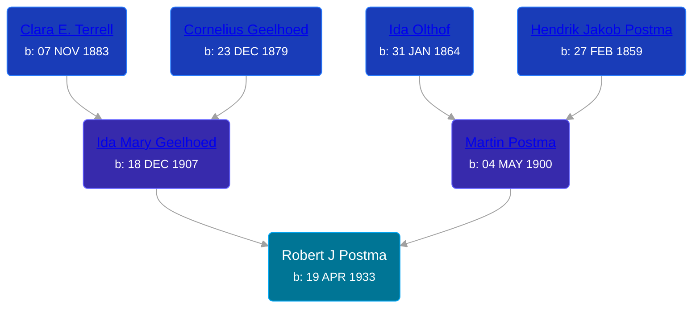

## 🔵 Robert J Postma
<small>Age: 8m, 11d</small>

Son of [Martin Postma](/people/7/7474832) and [Ida Mary Geelhoed](/people/1/11612484)





### 📆 Events


Type | Date | Age at Event | Place
------ | ------ | ------ | ------
Birth | 19 APR 1933 |  |
[Death](#event-event-3) | 30 DEC 1933 | 8m, 11d | Paris Township, Kent, Michigan, USA
[Burial](#event-event-4) | 02 JAN 1934 | 8m, 13d | Pine Hill Cemetery, Kentwood, Kent, Michigan, USA



- **Birth**
**Date**: 19 APR 1933, Age:
**Place**:
- **[Death](#event-event-3)**
**Date**: 30 DEC 1933, Age: 8m, 11d
**Place**: Paris Township, Kent, Michigan, USA
- **[Burial](#event-event-4)**
**Date**: 02 JAN 1934, Age: 8m, 13d
**Place**: Pine Hill Cemetery, Kentwood, Kent, Michigan, USA


### 📰 Event Sources

####  Death, 30 DEC 1933
* Michigan, Death Records, 1867-1950
>   
  > Name: Robert Postma  
  > Gender: Male  
  > Marital Status: Single  
  > Birth Date: Apr 19, 1933  
  > Birth Place: Grand Rapids, Kent County, Michigan  
  > Death Date: 30 Dec 1933  
  > Death Place: Paris, Kent, Michigan, USA  
  > Death Age: 8/12  
  > File Number: 010101  
  > Father: Martin Postma  
  > Mother: Ida Geelhoed

####  Burial, 02 JAN 1934
* Pine Hill Cemetery, Personal Visit
>   
  > Postma, Robert J.  
  > b: 19 Apr 1933; d: 30 Dec 1933
