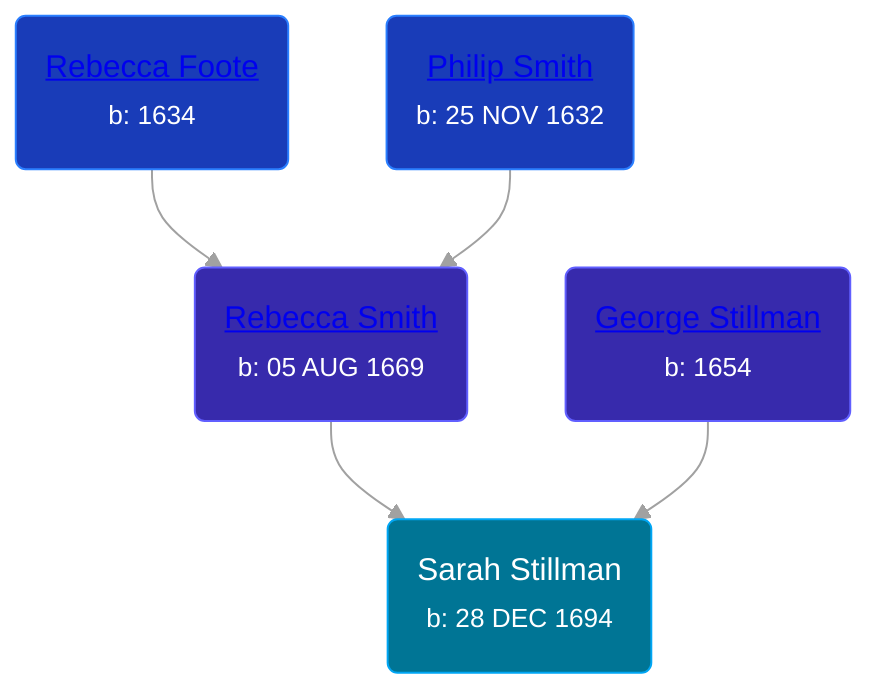

## 🟣 Sarah Stillman
<small>Age: 79y, 7m, 4d</small>

Daughter of [George Stillman](/people/6/67040632) and [Rebecca Smith](/people/7/76162584)





### 📆 Events


Type | Date | Age at Event | Place
------ | ------ | ------ | ------
[Birth](#event-event-3) | 28 DEC 1694 |  | Hadley, Massachusetts, USA
Death | 02 AUG 1774 | 79y, 7m, 4d | Saybrook, Middlesex, Connecticut, USA



- **[Birth](#event-event-3)**
**Date**: 28 DEC 1694, Age:
**Place**: Hadley, Massachusetts, USA
- **Death**
**Date**: 02 AUG 1774, Age: 79y, 7m, 4d
**Place**: Saybrook, Middlesex, Connecticut, USA


## 👩‍❤️‍👨 Relationships

### 🔵 [Samuel Willard](/people/1/12362566), b. 08 MAY 1693

#### Events


Type | Date | Age at Event | Place
------ | ------ | ------ | ------
[Marriage](#event-family-0-event-0) | 18 JAN 1715 | 20y, 20d | Saybrook, Middlesex, Connecticut, USA



- **[Marriage](#event-family-0-event-0)**
**Date**: 18 JAN 1715, Age: 20y, 20d
**Place**: Saybrook, Middlesex, Connecticut, USA


#### Children With Samuel Willard
* 🔵 [Samuel Willard](/people/9/94843380), b. 06 SEP 1715
* 🟣 [Sarah Willard](/people/2/24374592), b. 18 MAY 1717
* 🟣 [Rebecca Willard](/people/6/62544636), b. 02 MAY 1719
* 🟣 [Hannah Willard](/people/7/75872420), b. 12 DEC 1720
* 🔵 [Elisha Willard](/people/6/625742), b. 09 FEB 1724
* 🔵 [George Willard](/people/3/31530910), b. 12 JUN 1726
* 🟣 [Martha Willard](/people/9/9026760), b. 16 MAR 1728
* 🔵 [Joseph Willard](/people/7/72246450), b. 18 MAY 1730
* 🔵 [Elisha Willard](/people/7/77525708), b. 13 JAN 1733
* 🔵 [Elisha Willard](/people/9/98758913), b. 12 AUG 1736
### 📰 Event Sources

####  Birth, 28 DEC 1694
* The Foote Family: or the Descendants of Nathaniel Foote  - 279

####  Marriage, 18 JAN 1715
* The Foote Family: or the Descendants of Nathaniel Foote  - 283
* American Ancestry: Giving Name and Descent  - 95